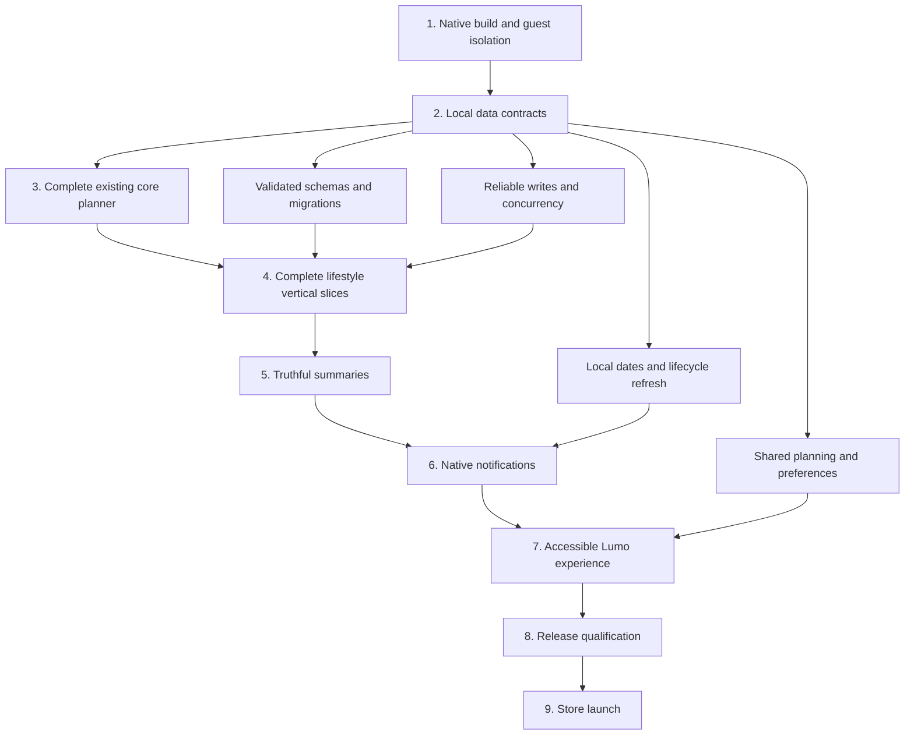

# Lumo MVP → Launch Master Implementation Plan

**Roadmap version: 1.0**

**Governing baseline:** [repository-product-launch-readiness-audit.md](/Users/echoin.ink/Developer/lumo/docs/repository-product-launch-readiness-audit.md)

This plan converts the completed audit into an execution sequence. It does not introduce new audit findings or claim that any finding has been resolved.
No files were modified during this planning run. This response is the execution roadmap; it has not been written into the repository.

## Execution Contract

**These decisions govern every phase:**
- Preserve React Native, Expo Router, feature-specific Zustand stores, MMKV, existing repository/service boundaries, and Lumo’s visual identity.
- Retain maintainable equivalents such as the existing services-based storage and repository directories.
- Keep all requested lifestyle domains in MVP scope.
- Exclude accounts, authentication, cloud synchronization, AI, monetization and subscriptions from the local release experience.
- Preserve deferred backend implementation where useful, but prevent it from affecting guest startup or appearing as available functionality.
- Use the existing feature task and habit implementations as the canonical starting points.
- Implement missing domains as complete local vertical slices.
- Keep routes lightweight when modifying affected screens; do not conduct a wholesale file relocation.
- Fix essential accessibility defects while touching components. Phase 7 is the final accessibility acceptance pass, not permission to introduce inaccessible UI earlier.
- Do not automatically proceed into another phase. Complete its acceptance gate, report the result, and stop.
- A failed or unperformed required check means the gate remains open.
- New evidence discovered during implementation may amend the affected work package. It does not justify restarting the repository audit or expanding scope.

### Bounded MVP Decisions

- Calendar initially provides a task-backed schedule with task creation/editing. A separate event-management system is deferred; unsupported “Add Event” controls are removed.
- The current light visual identity remains. Dark mode is deferred and its nonfunctional control removed.
- Simplified mode, reduced motion and haptic controls remain in scope because the existing experience promises them.
- Calories use consumed meal entries as their canonical intake source. Planned meals do not count as consumed food.
- Payments are local bill/payment records, not financial transactions executed against external services.
- Advanced weekly dashboards are deferred. Existing mock weekly-dashboard routes are retired.
- A small contextual mascot system is included; an extensive animation library is not.

## 1. Phase Map

| Phase | Purpose | Required exit state |
|---|---|---|
| 1 — Native build and foundation blockers | Remove the native build failure and isolate local startup | Both native exports pass; installable guest builds; dependency issues triaged |
| 2 — Local data integrity and persistence contracts | Establish dependable storage, mutations, dates and shared state | Validated, recoverable, migration-safe local data; no silent successful saves |
| 3 — Complete the existing core planner | Finish tasks, habits, planning, capture, calendar and preferences | Existing core workflows work through restart and recovery |
| 4 — Replace lifestyle placeholders | Complete each missing domain end to end | Every lifestyle domain has real local CRUD and integration |
| 5 — Make summaries truthful | Connect canonical records to Dashboard, Health and totals | Every displayed metric has a tested source and definition |
| 6 — Native reminders and notifications | Deliver actual local reminders | Scheduling, cancellation, reconciliation and tap routing work on both platforms |
| 7 — Accessibility, UX, design system and mascot | Complete the accessible Lumo experience | Cross-app sensory controls, accessibility and brand acceptance pass |
| 8 — Production hardening and release qualification | Prove reliability and produce reproducible release builds | Production release candidate |
| 9 — Store launch | Prepare, submit and distribute the verified release | App Store and Google Play launch |

### Milestones

- After Phase 3: reliable core-planner alpha.
- After Phase 7: complete local-first MVP, subject to all earlier gates remaining valid.
- After Phase 8: production release candidate.
- After Phase 9: launched product.

## 2. Dependency Map

### Dependencies Inside Phase 4

**Execute these slices serially:**
**Sequence:** Cleaning → Meals → Recipes → Groceries → Weekly meal planner → Budget → Expenses → Payments → Calories → Weight → Workouts → Body measurements
**This ordering is deliberate:**
- Meals establishes consumed-food records before calorie aggregation.
- Recipes become usable independently before the planner references them.
- Groceries works independently before the planner generates shopping items.
- The weekly planner can therefore finish its actual grocery integration within its own package.
- Budget defines periods, currency and limits before the transaction ledger is connected.
- Expenses establish actual spending before payments create or link spending records.
- Wellness summaries follow real dated records.
A later slice may extend an earlier completed domain through its public service interface. It must preserve and rerun that domain’s acceptance tests.

### Shared Dependency Rules

1. No new persisted domain before Phase 2 passes.
2. No cross-feature summary may maintain an independent copy of source records.
3. No native reminder may be attached to an entity without a stable ID and defined edit/delete lifecycle.
4. No legacy persistence path is deleted before its migration and compatibility obligations are resolved.
5. No phase gate may be satisfied using web persistence as a substitute for native restart verification.

## 3. Detailed Phases and Work Packages

### Common Requirements for Every Work Package

**Every package must:**
- Begin with targeted inspection of the affected implementation and relevant audit evidence—not a repository-wide re-audit.
- Preserve unrelated working behavior.
- Run TypeScript, relevant existing tests, and appropriate lint checks.
- Add regression tests for changed behavior where meaningful.
- Record manual verification separately from automated checks.
- Report audit IDs addressed, changes made, test results, remaining risks and gate status.
- Avoid claiming native behavior was verified when only helper tests or browser checks ran.

### Mandatory Vertical-Slice Contract: V

**Every Phase 4 package includes all of the following:**
1. Domain types and validation rules.
2. Versioned local repository/storage.
3. Canonical store and domain operations.
4. Complete create/read/update/delete behavior appropriate to that domain.
5. UI using existing Lumo primitives.
6. Validation and duplicate-submission protection.
7. Empty, hydration, error and failed-save states.
8. Integration with already-completed related domains.
9. Repository, store and integration tests.
10. Native save → terminate → reopen verification.
References to V-tests, V-manual and V-Done below incorporate these requirements; they are mandatory, not optional shorthand.

### Phase 1 — Native Build and Foundation Blockers

#### Goal

Make Lumo build and run natively as an account-free local application.

#### Why it happens now

The audit’s P0 failure prevents reliable mobile verification. Storage and feature work must not proceed while the native release bundle is broken.

#### Audit findings addressed

- P0: B01.
- P1: B20, through exclusion of the unsupported account surface.
- P2: B33, B34; initial portion of B32.
- Placeholder/deferred paths: S40, S43.

#### Files / systems likely affected

- [Root layout](/Users/echoin.ink/Developer/lumo/app/_layout.tsx)
- [Auth bootstrap hook](/Users/echoin.ink/Developer/lumo/src/features/auth/hooks/useSessionBootstrap.ts)
- [Auth session store](/Users/echoin.ink/Developer/lumo/src/features/auth/store/useAuthSessionStore.ts)
- [Supabase auth client](/Users/echoin.ink/Developer/lumo/src/services/api/auth/supabaseAuth.client.ts)
- [Account screen](/Users/echoin.ink/Developer/lumo/app/(tabs\)/more/account.tsx)
- [Package manifest](/Users/echoin.ink/Developer/lumo/package.json), lockfile, Metro/Babel configuration and app configuration.

#### WP1.1 — Restore native production exports and isolate guest startup

- Objective: Close B01 before unrelated P1 work.
- Current problem: Supabase enters the production dependency graph and Hermes rejects its dynamic import, even without remote configuration.
- Intended implementation: Reproduce the known failure; remove deferred account/cloud requirements from the local startup and production route graph. Resolve any remaining demonstrated dependency-entry incompatibility using the smallest supported change.
- Architectural constraints: No authentication implementation, cloud setup, Hermes disablement, broad dependency upgrade, or loss of existing local data. Hiding a menu item alone is insufficient if its route still bundles the failing dependency.
- Modules: Root layout, auth bootstrap/client, account/auth routes, package/build configuration.
- Tests required: Separate iOS and Android production exports; existing tests and TypeScript; web export regression.
- Manual verification: Confirm the resulting local build path does not require credentials or environment variables.
- Dependencies: Audit baseline and this roadmap only. Read the exact Expo SDK 55 documentation before writing code.
- Definition of Done: Both native production exports pass; local startup has no required account initialization; unsupported account routes cannot expose incomplete account behavior.

#### WP1.2 — Resolve compatibility and security findings

- Objective: Establish a supported, reproducible dependency set.
- Current problem: Doctor reports patch mismatches; the dependency audit contains unresolved advisories; installation settings obscure peer compatibility.
- Intended implementation: Apply necessary SDK-compatible corrections, triage advisories by dependency path and reachable exposure, resolve contradictory package configuration, and declare directly used packages where appropriate.
- Architectural constraints: No blanket audit fix --force, cross-generation downgrade, or speculative upgrade. Preserve native framework dependencies required indirectly.
- Modules: Package manifest/lockfile, npm configuration, relevant Metro/Babel dependency configuration.
- Tests required: Clean install, Doctor, dependency audit, TypeScript, existing tests, both native exports.
- Manual verification: Review every remaining advisory disposition and verify native module startup.
- Dependencies: WP1.1.
- Definition of Done: No unexplained compatibility mismatch or untriaged serious exposure remains; the lockfile reproduces the tested dependency set.

#### WP1.3 — Establish installable builds and native validation gates

- Objective: Provide a reliable device-testing baseline.
- Current problem: Validation currently proves web export but not native installation.
- Intended implementation: Add explicit native export validation and the minimum development/preview build configuration needed for repeatable device testing. Establish EAS profiles without introducing any runtime backend dependency.
- Architectural constraints: No final store submission or OTA rollout yet; build tooling is separate from app data architecture.
- Modules: Package scripts, app configuration, new EAS configuration, existing native configuration strategy.
- Tests required: Clean configuration resolution, both native exports and native compilation.
- Manual verification: Install and cold-launch on iOS and Android; reopen in airplane mode without account configuration.
- Dependencies: WP1.1–WP1.2.
- Definition of Done: Repeatable installable builds exist for both platforms, with documented commands and passing guest smoke checks.

#### Risk points

Auth imports may enter through routes as well as root bootstrap. Dependency changes can affect MMKV/Nitro, Reanimated and Metro. Do not delete stored guest/session data merely to simplify startup.

#### Explicitly out of scope

Auth repair, guest-to-cloud migration, synchronization, feature implementation, redesign, subscriptions and analytics infrastructure.

#### Phase Acceptance Gate — G1

- B01 is closed by successful independent native exports.
- Both platforms install and launch without remote configuration.
- Guest startup works offline.
- Dependency compatibility/security dispositions are recorded.
- No existing tests regress.

### Phase 2 — Local Data Integrity and Persistence Contracts

#### Goal

Make local state durable, recoverable and consistent before adding more functionality.

#### Why it happens now

Every subsequent feature depends on reliable writes, schemas, dates and canonical state. Fixing these after adding domains would multiply migration and data-loss risk.

#### Audit findings addressed

B07–B13, B17, B21, B22, B27, B34, B35, B40.
Supporting placeholder findings: S19–S21, S24, S41.

#### Files / systems likely affected

- [Service storage adapter](/Users/echoin.ink/Developer/lumo/src/services/storage/mmkv.ts)
- [Store storage adapter](/Users/echoin.ink/Developer/lumo/src/store/storage.ts)
- [Persist adapter](/Users/echoin.ink/Developer/lumo/src/store/createPersistStorage.ts)
- [Task feature](/Users/echoin.ink/Developer/lumo/src/features/tasks)
- [Habit feature](/Users/echoin.ink/Developer/lumo/src/features/habits)
- [Planning feature](/Users/echoin.ink/Developer/lumo/src/features/planning)
- [Settings store](/Users/echoin.ink/Developer/lumo/src/store/useSettingsStore.ts)
- [UI primitives](/Users/echoin.ink/Developer/lumo/src/components/ui)
- Existing brain-dump, reminder and onboarding storage services.

#### WP2.1 — Establish canonical ownership and storage compatibility

- Objective: Give each domain one authoritative implementation.
- Current problem: Duplicate stores, keys and MMKV adapters have different semantics.
- Intended implementation: Document canonical domain ownership; align adapter contracts; preserve existing namespaces where useful; define migrations for any legacy records that need incorporation. Make the development web adapter durable rather than memory-only.
- Architectural constraints: No wholesale store replacement or automatic merging of incompatible records. Never erase conflicting legacy data as a shortcut.
- Modules: Both adapters, persist adapter, storage keys, active/legacy task, habit, settings and onboarding stores.
- Tests required: Existing-key compatibility, namespace isolation, repeatable migrations, divergent legacy-record fixtures and web reload persistence.
- Manual verification: Upgrade seeded native installations and verify tasks, habits and preferences remain available.
- Dependencies: G1.
- Definition of Done: Canonical ownership and migration precedence are explicit; active consumers share those sources; obsolete paths cannot silently become new production sources.

#### WP2.2 — Add validated schemas and corrupted-data recovery

- Objective: Prevent invalid local state from becoming crashes or silent data replacement.
- Current problem: Parsed JSON is trusted; failures can produce empty arrays that overwrite recoverable records.
- Intended implementation: Add schema versions and domain validation, preserve invalid raw data, distinguish empty from unreadable storage, and provide retry/recovery without silently resetting everything.
- Architectural constraints: Reuse existing error/recovery primitives. No new general-purpose persistence framework or database replacement.
- Modules: Active repositories/storage services, hydration state, ErrorState/RetryView/RecoverySheet.
- Tests required: Malformed JSON, wrong shapes, invalid fields, unknown schema versions, migration failure and interrupted migration.
- Manual verification: Open an installation with seeded corruption; recover valid records without deleting unaffected domains.
- Dependencies: WP2.1.
- Definition of Done: Hydration settles into ready or actionable error state; invalid data is preserved until an explicit recovery decision; no silent overwrite occurs.

#### WP2.3 — Standardize durable mutations and serialize conflicting writes

- Objective: Make “saved” mean persisted.
- Current problem: Background failures are swallowed and concurrent habit mutations can lose records.
- Intended implementation: Return meaningful save outcomes, serialize conflicting read-modify-write operations, and propagate failures to forms. Optimistic updates must roll back or show an explicit unsaved state.
- Architectural constraints: Preserve responsive UI; do not move persistence into components.
- Modules: Task/habit repositories and stores, existing feature storage services, mutation hooks and forms.
- Tests required: Concurrent create/edit/complete/delete, injected storage failures, retries and duplicate submissions.
- Manual verification: Trigger failure, retry, terminate and reopen; verify both UI and disk agree.
- Dependencies: WP2.1–WP2.2.
- Definition of Done: No successful UI acknowledgement precedes durable success; overlapping mutations retain all intended changes.

#### WP2.4 — Define local date/time semantics

- Objective: Establish one date policy for every domain.
- Current problem: UTC slicing, fixed millisecond offsets and mount-only date calculations produce incorrect local days.
- Intended implementation: Separate local date keys, wall-clock times and timestamp instants; provide shared date operations; refresh date-dependent state on foregrounding and day changes; define DST and timezone-change behavior.
- Architectural constraints: Preserve existing valid dates. Do not invent times when migrating ambiguous legacy text.
- Modules: Existing utilities, task form/filter helpers, calendar, habits, planning and reminder presets.
- Tests required: Auckland boundaries, positive/negative offsets, DST transitions, month/year rollover and foreground refresh.
- Manual verification: Change device date/timezone and resume the app around midnight.
- Dependencies: WP2.2.
- Definition of Done: All affected modules use the documented policy; a local day is never accidentally derived by slicing an instant’s UTC string.

#### WP2.5 — Create shared planning state and durable parking

- Objective: Eliminate independent mounted copies of daily planning.
- Current problem: Planning screens overwrite or fail to observe one another; parking disappears with daily summaries.
- Intended implementation: Introduce a small shared planning store over the existing planning service. Separate durable parking metadata from daily summary state and resolve selected steps by stable entity identity.
- Architectural constraints: Keep existing planning components and composition logic. Do not store duplicate task/habit records in planning.
- Modules: Planning hook/service/types, a feature planning store, ParkedItemsScreen and Dashboard consumers.
- Tests required: Multiple subscribers, day rollover, restart, deleted source entities and selection-rank changes.
- Manual verification: Move among Dashboard, morning, evening and Parked without reloading.
- Dependencies: WP2.2–WP2.4.
- Definition of Done: Mounted views update immediately; parked records survive day changes; selections do not depend on shortlist ranking.

#### WP2.6 — Repair shared UI contracts

- Objective: Prevent foundational styling and accessibility defects from spreading.
- Current problem: Caller styles replace Card/Button defaults; important contrast pairs and control semantics are defective.
- Intended implementation: Compose styles correctly, forward props deliberately, correct essential contrast pairs and preserve minimum interactive sizing. Establish reusable label/state/error conventions.
- Architectural constraints: Preserve visual identity and feature-specific layouts; do not replace every card with one generic presentation.
- Modules: Card, Button, Screen, Text, Input, ProgressBar and theme tokens.
- Tests required: Focused regression checks for default-plus-caller style behavior and prop forwarding; existing checks.
- Manual verification: Inspect affected existing screens on small devices and with enlarged text.
- Dependencies: WP2.1; performed after the principal data-contract packages.
- Definition of Done: Caller customization preserves required defaults, and shared primitives provide accessible behavior for subsequent slices.

#### Risk points

Migrations can overwrite data, adapters can change namespaces, date changes can reinterpret old records, and style fixes can reveal layouts that previously depended on broken defaults.

#### Explicitly out of scope

Cloud ownership migration, generic repository frameworks, full backup-product development, new lifestyle domains and visual redesign.

#### Phase Acceptance Gate — G2

- Wrong-shape and corrupt data produce recoverable outcomes.
- Existing valid records survive migration.
- Concurrent habit writes retain all changes.
- Failed writes cannot appear successfully saved.
- Shared planning state synchronizes and parking survives rollover.
- Local date/time policy passes boundary tests.
- Native restart verifies existing tasks, habits and preferences.
- Card/Button contract regressions are closed.

### Phase 3 — Complete the Existing Core Planner

#### Goal

Finish the partially implemented daily planning experience.

#### Why it happens now

The core is already functional and should become trustworthy before unrelated lifestyle domains are added.

#### Audit findings addressed

B04–B06, B10–B19, B23–B26, B28–B31, B34–B37, B40, B42.
Key placeholder findings: S03–S07, S16–S27, S28–S31.

#### Files / systems likely affected

- [Tasks](/Users/echoin.ink/Developer/lumo/src/features/tasks)
- [Habits](/Users/echoin.ink/Developer/lumo/src/features/habits)
- [Planning](/Users/echoin.ink/Developer/lumo/src/features/planning)
- [Brain dump](/Users/echoin.ink/Developer/lumo/src/features/brain-dump)
- [Routines](/Users/echoin.ink/Developer/lumo/src/features/routines)
- [Onboarding](/Users/echoin.ink/Developer/lumo/src/features/onboarding)
- [QuickCaptureSheet](/Users/echoin.ink/Developer/lumo/src/components/capture/QuickCaptureSheet.tsx)
- Existing task, calendar, settings and Dashboard routes.

#### WP3.1 — Complete task CRUD, dates and times

- Objective: Make task creation/editing preserve all supported fields.
- Current problem: Creation drops dueTime; editing arbitrary dates can clear them; validation and filters are incomplete.
- Intended implementation: Preserve validated date/time fields throughout the existing flow, support arbitrary dates, await saves, and make overdue/undated treatment explicit.
- Architectural constraints: Keep the existing task model/store/repository lineage; do not introduce tags or project hierarchies.
- Modules: Task types, form, store, repository, filters and rows.
- Tests required: Create/edit round trips for every field; existing arbitrary-date preservation; invalid time; failed save; filter boundaries.
- Manual verification: Create, edit, complete, undo, delete and restart from both Tasks and quick capture.
- Dependencies: G2.
- Definition of Done: No field disappears; failed saves remain recoverable; date filters behave consistently.

## Phase 3 — Core Product Completion

Phase 3 completes the existing Lumo product surfaces before Phase 4 begins.

Implementation is grouped into **four execution prompts** rather than one prompt per work package.

### Execution grouping

* **Prompt 1:** WP3.1 — Complete task CRUD, dates and times
* **Prompt 2:** WP3.2 + WP3.3 — Task recurrence + Habit management/history
* **Prompt 3:** WP3.4 + WP3.5 — Planning/recovery + Capture/conversion durability
* **Prompt 4:** WP3.6 + WP3.7 + WP3.8 — Calendar + Onboarding/preferences + Navigation cleanup, followed by G3

Each prompt must update `docs/lumo-implementation-progress.md` before stopping.

---

#### WP3.1 — Complete task CRUD, dates and times

* **Objective:** Make every currently supported task field survive create, edit, persistence and restart correctly.
* **Current problem:** Task creation can drop `dueTime`; editing can replace arbitrary dates; date selection is restricted; save completion can precede durable persistence.
* **Intended implementation:** Fix field round-tripping, support arbitrary valid dates, validate time consistently, await durable saves and define consistent filtering behavior for overdue, undated, Today and Upcoming tasks.
* **Architectural constraints:** Preserve the canonical task store/repository architecture. Do not add projects, tags, subtasks or cloud synchronization.
* **Modules:** Task form, task repository/store, Quick Capture task creation and task filtering utilities.
* **Tests required:** Create/edit round trips for every supported field, arbitrary-date preservation, invalid time, failed saves and date-filter boundaries.
* **Manual verification:** Create, edit, complete, undo and delete tasks through Tasks and Quick Capture, then terminate/reopen.
* **Dependencies:** G2.
* **Definition of Done:** No supported task field disappears, persistence failures remain recoverable and task date filters behave consistently.

---

#### WP3.2 — Execute task recurrence

* **Objective:** Make exposed repeat controls operational.
* **Current problem:** Recurrence exists as metadata but does not reliably create or advance occurrences.
* **Intended implementation:** Define the smallest necessary series/occurrence identity model, correct and reuse the existing recurrence utility, advance supported recurrence exactly once and retain completion history with predictable edit, undo and restart behavior.
* **Architectural constraints:** Reuse the existing recurrence utility after correcting tested edge cases. Do not generate an overwhelming backlog of missed occurrences.
* **Modules:** Task recurrence types/utilities, canonical task repository/store and recurrence picker.
* **Tests required:** Daily, weekly, monthly, intervals, month-end, leap years, DST, repeated completion, repeated taps, undo and restart.
* **Manual verification:** Complete a repeating task, reopen the app, edit the next occurrence and undo completion.
* **Dependencies:** WP3.1.
* **Definition of Done:** Every exposed recurrence option creates or advances the correct occurrence exactly once without duplicate records or lost history.

---

#### WP3.3 — Complete habit management and history

* **Objective:** Make every habit manageable and ensure habit feedback is accurate.
* **Current problem:** Off-day habits are difficult to access; streak calculations can become incorrect or stale; deletion lacks a reliable recovery path.
* **Intended implementation:** Add an all-habits management path, simple dated completion history, correct schedule-aware streak calculations, truthful historical-best semantics, weekly-day validation and recoverable deletion.
* **Architectural constraints:** Use the canonical feature habit store/repository and dated completion history. Do not introduce a second statistics source.
* **Modules:** Habit form, lists, hooks, store/repository and Health/More consumers.
* **Tests required:** Scheduled days, off days, missed days, yesterday-only streak, historical best, undo, concurrent completion, deletion recovery and restart.
* **Manual verification:** Edit an off-day habit, inspect history, miss a scheduled day, resume the habit and restart.
* **Dependencies:** G2.
* **Definition of Done:** Every habit is retrievable and manageable; history and streaks reflect persisted records; deletion and failed operations remain recoverable.

---

#### WP3.4 — Complete planning and recovery behavior

* **Objective:** Make morning planning, evening review, parking and recovery dependable.
* **Current problem:** Restoring parked work can leave dates shifted; low-energy suggestions can misclassify tasks; selected steps can disappear when recommendations change.
* **Intended implementation:** Connect planning screens to shared state, define explicit return-from-parking behavior, correctly restore parked work, retain stable source identity and prevent ranking changes from removing selected intentions.
* **Architectural constraints:** Planning references canonical task and habit entities rather than copying them into a second data model.
* **Modules:** Planning composer/store/hooks/screens, Parked Items and Dashboard planning surfaces.
* **Tests required:** Park/restore across days, deleted references, low-energy selection, completed habits, changing shortlist rankings, simultaneous mounted planning screens and restart.
* **Manual verification:** Morning Planning → modify task → Evening Review → Parked Items → restore → restart.
* **Dependencies:** WP2.5, WP3.1–WP3.3.
* **Definition of Done:** Planning cannot lose an intention and every planning surface represents the same persisted state.

---

#### WP3.5 — Make capture and conversion durable

* **Objective:** Preserve captured thoughts through every conversion path.
* **Current problem:** Routine ideas can become inaccessible and a source can be marked converted before the destination has been durably created.
* **Intended implementation:** Await destination persistence, introduce stable conversion identity/idempotency, retain recoverable sources on failure, keep routine ideas accessible as notes, add Brain Dump editing and reject empty conversion bundles.
* **Architectural constraints:** Use a small recoverable local operation for multi-record conversion rather than a distributed transaction framework. Preserve the existing capture/task/reminder architecture.
* **Modules:** Brain Dump store/screens, Quick Capture Sheet, reminder records and routine bundle application.
* **Tests required:** Failure at each conversion step, retry, duplicate tap, interrupted conversion, restart, empty bundle and edit persistence.
* **Manual verification:** Convert an item, interrupt/reopen, retry and confirm exactly one accessible destination exists.
* **Dependencies:** WP2.3, WP3.1, WP3.4.
* **Definition of Done:** Every successful conversion creates exactly one durable destination; unsuccessful conversion leaves an actionable source.

---

#### WP3.6 — Complete task-backed calendar interactions

* **Objective:** Make Calendar an actionable task-backed schedule.
* **Current problem:** Calendar can display tasks but cannot fully create or edit them and contains a dead control.
* **Intended implementation:** Add task creation for the selected date, task editing, completion, correct time ordering and a useful date action or removal of the unused control.
* **Architectural constraints:** Tasks remain the sole source of truth. Do not introduce a separate event database, system-calendar integration or Calendar redesign.
* **Modules:** Existing Calendar route/utilities and canonical task form/domain operations.
* **Tests required:** Selected-date creation, editing/date movement, time ordering, completion, deletion, navigation and restart.
* **Manual verification:** Create from Calendar → edit from Tasks → return to Calendar → terminate/reopen.
* **Dependencies:** WP3.1–WP3.2.
* **Definition of Done:** Calendar and Tasks remain immediately consistent and durable.

---

#### WP3.7 — Apply onboarding and preferences

* **Objective:** Make every retained onboarding/settings option affect the real product.
* **Current problem:** First launch can bypass onboarding and several exposed preferences are disconnected from product behavior.
* **Intended implementation:** Gate first-run navigation after hydration, correctly persist onboarding completion, apply supported selections, enforce haptic preferences centrally, unify reduced-motion behavior and make Simplified Mode meaningfully reduce secondary content.
* **Architectural constraints:** Maintain one canonical preference per behavior. Keep the existing light visual system and do not invent adaptive personalization.
* **Modules:** Root navigation, onboarding feature, settings store/screen, haptic call paths and reduced-motion/Simplified Mode consumers.
* **Tests required:** Fresh install, completed onboarding, interrupted setup, persisted settings, restart, haptic paths and Simplified Mode navigation.
* **Manual verification:** Fresh install → complete/skip supported onboarding → restart → disable haptics → enable reduced motion/Simplified Mode → verify behavior.
* **Dependencies:** G2 and completed core product screens.
* **Definition of Done:** Onboarding occurs at the correct time and every remaining exposed preference demonstrably affects behavior.

---

#### WP3.8 — Retire obsolete production routes and repair navigation

* **Objective:** Eliminate blank, starter, mock and dead-end production routes.
* **Current problem:** Hidden or obsolete routes remain reachable; legacy add surfaces do not perform useful actions; fallback navigation is inconsistent.
* **Intended implementation:** Remove or safely redirect obsolete Add routes/modals, the mock weekly Dashboard, Expo Explore/tutorial and production-facing Testing entries; repair cold-link and back-navigation fallbacks.
* **Architectural constraints:** Do not bulk-delete unused source modules or reset the project. Preserve useful feature code outside the active production route graph.
* **Modules:** Router layouts, obsolete routes, More/header navigation and `ScreenBackButton`.
* **Tests required:** Route resolution, retired-route behavior, cold links, safe back behavior and restart.
* **Manual verification:** Open supported destinations directly, navigate back without existing history and verify retired routes do not expose dead surfaces.
* **Dependencies:** WP3.5–WP3.7.
* **Definition of Done:** Every production route either provides usable content or intentionally redirects to a safe supported destination.

---

## Risk points

* Recurrence, retry and undo flows can create duplicate records if idempotency is incomplete.
* Date/filter changes can hide otherwise valid tasks.
* Existing stored preferences may conflict with newer canonical preference behavior.
* Planning references can become stale when source tasks or habits are deleted.
* Route cleanup can unintentionally change navigation history or deep-link behavior.
* Multi-step conversions can lose source state if persistence ordering is incorrect.

---

## Explicitly out of scope

* Projects
* Subtasks
* Tags
* Adaptive AI planning
* Standalone calendar events
* System-calendar integration
* Timers
* Customizable routine libraries
* Cloud accounts/synchronization
* Dark Mode
* New personalization intelligence

---

## Phase Acceptance Gate — G3

Phase 3 passes only when the integrated product satisfies all of the following:

### Tasks

* Supported task fields persist correctly through create/edit/restart.
* Arbitrary dates and valid times are preserved.
* Overdue, undated, Today and Upcoming behavior is consistent.
* Task recurrence advances exactly once.
* Recurrence does not create duplicate occurrences.
* Completion history survives restart.
* Recurrence edit and undo behavior is predictable.

### Habits

* Every habit is retrievable and manageable.
* Completion history is persisted.
* Current and historical streak calculations are schedule-aware and truthful.
* Deletion remains recoverable.

### Planning and capture

* Morning/evening planning surfaces use the same persisted state.
* Parking and restoration cannot silently lose or shift an intention incorrectly.
* Quick Capture and Brain Dump conversions cannot lose the source on failure.
* Conversion retries do not create duplicate destinations.

### Calendar

* Calendar and Tasks use the same canonical task records.
* Creation, editing, movement, completion and deletion remain synchronized.
* State survives termination/restart.

### Onboarding and preferences

* First-run onboarding occurs correctly after hydration.
* Completed onboarding remains completed after restart.
* Haptics respect the canonical setting.
* Reduced motion behaves consistently.
* Simplified Mode changes presentation without hiding essential actions.
* Unsupported controls are removed.

### Navigation

* No obsolete core production route remains as a blank, starter, mock or dead-end surface.
* Direct/cold navigation has a safe fallback.
* Back navigation behaves correctly without existing history.

### G3 result

Record the gate as:

* **PASS** when all acceptance criteria are verified, or
* **BLOCKED** when implementation is complete but specific verification evidence remains outstanding.

Update `docs/lumo-implementation-progress.md` with the status of each completed work package, validation evidence and final G3 result.

**STOP before Phase 4.**

### Phase 4 — Replace Lifestyle Placeholders With Real Local Workflows

#### Compressed execution plan — 5 prompts

Prompt 1: WP4.1 Cleaning + WP4.2 Meals

Prompt 2: WP4.3 Recipes + WP4.4 Groceries + WP4.5 Weekly Meal Planner

Prompt 3: WP4.6 Budget/Categories + WP4.7 Expenses/Income + WP4.8 Payments

Prompt 4: WP4.9 Calories + WP4.10 Weight

Prompt 5: WP4.11 Workouts + WP4.12 Body Measurements, then G4

Work packages retain their individual scope, dependencies and Definition of Done. Grouping changes session boundaries only.

#### Goal

Finish the declared lifestyle domains as complete, usable local features.

#### Why it happens now

The persistence and interaction patterns are now proven. Each new slice can reuse them without reproducing the audit’s UI-first scaffolding.

#### Audit findings addressed

B02, B07, B09, B13, B25, B26, B34, B35, B42.

Placeholder findings: S08–S15, S39.

#### Files / systems likely affected

Existing [More routes](/Users/echoin.ink/Developer/lumo/app/(tabs\)/more), [Health route](/Users/echoin.ink/Developer/lumo/app/(tabs\)/health.tsx), [feature modules](/Users/echoin.ink/Developer/lumo/src/features), current meal/budget stores and stub repositories.

New domain modules belong within the existing feature-first structure. These are new product implementations, not a replacement architecture.

#### WP4.1 — Cleaning

- Objective: Replace sample chores with real routines/items.

- Current problem: Static completion and disabled scheduling.

- Implementation: Complete V for routines/items, dates, completion and supported repetition; derive progress from actual occurrences.

- Constraints: One cleaning source; avoid separately editable duplicate task copies.

- Modules: Existing Cleaning screen, new cleaning feature module, proven date/recurrence services.

- Tests: V-tests plus completion recurrence, skipped days and deletion.

- Manual: V-manual plus edit schedule and complete a repeated cleaning item.

- Dependencies: G3.

- Done: All displayed chores belong to the user; completion and schedules survive restart.

#### WP4.2 — Meals

- Objective: Implement consumed meal entries.

- Current problem: Sample meals and fixed calorie totals.

- Implementation: Complete V for dated meal entries, meal type, description and optional manually entered nutrition.

- Constraints: Consumed meals are distinct from future meal plans; no nutrition API.

- Modules: Existing Meals screen, meal model/store and replacement of the stub repository.

- Tests: V-tests plus date boundaries, optional nutrition and edit/delete totals.

- Manual: V-manual plus multiple meal types and dates.

- Dependencies: WP4.1.

- Done: Meal history and local totals contain only saved consumed entries.

#### WP4.3 — Recipes

- Objective: Add basic saved recipe management.

- Current problem: No recipe domain exists.

- Implementation: Complete V for names, ingredients, quantities/units, instructions and servings; allow logging a meal from a recipe.

- Constraints: Preserve historical meal snapshots when recipes change; no scraping, AI generation or favourites requirement.

- Modules: New recipe feature, completed meal service and a lightweight route.

- Tests: V-tests plus serving quantities, recipe-to-meal logging and recipe deletion with existing meal history.

- Manual: V-manual plus log a recipe as a consumed meal.

- Dependencies: WP4.2.

- Done: Recipes are independently useful and meal history does not change retroactively.

#### WP4.4 — Groceries

- Objective: Replace the static shopping list with real grocery management.

- Current problem: Fixed items and visual-only checks.

- Implementation: Complete V for list items, quantity/unit, checked state and editing; expose a domain operation for adding recipe ingredients.

- Constraints: Preserve manual edits and checked state; do not show planner-generation controls before the planner exists.

- Modules: Existing Groceries screen, new groceries feature and recipe ingredient types.

- Tests: V-tests plus checking/undo, quantity validation and duplicate ingredient handling.

- Manual: V-manual plus shopping-list edits and restart with checked items.

- Dependencies: WP4.3.

- Done: The grocery list is fully usable on its own and ready for actual planner integration.

#### WP4.5 — Weekly Meal Planner

- Objective: Implement persistent weekly meal assignments and shopping integration.

- Current problem: Entire domain is missing.

- Implementation: Complete V for day/meal-slot assignments referencing recipes or manual meal descriptions; generate/update groceries through the completed grocery service.

- Constraints: Planned food never counts as consumed. Repeated generation must not duplicate items or erase manual shopping changes.

- Modules: New meal-planning feature, recipe and grocery services, meal logging integration.

- Tests: V-tests plus week rollover, reassignment, deleted recipes, repeated grocery generation and interrupted integration.

- Manual: Plan a week, generate groceries twice, edit the plan and log one meal as consumed.

- Dependencies: WP4.2–WP4.4.

- Done: The planner, groceries and meal log remain distinct but correctly connected.

#### WP4.6 — Budget and Categories

- Objective: Establish real budget limits and periods.

- Current problem: Categories and amounts are constants.

- Implementation: Complete V for categories, period limits and currency; calculate against actual persisted transactions, initially an empty ledger.

- Constraints: Use integer minor monetary units or an equivalent precise representation; no bank connectivity or multi-currency conversion.

- Modules: Existing Budget screen, canonical budget types/store and real local repository.

- Tests: V-tests plus rounding, period boundaries, category deletion and zero-data totals.

- Manual: Create/edit a monthly budget and reopen.

- Dependencies: WP4.5.

- Done: Budget setup is real, durable and independent of sample spending.

#### WP4.7 — Expenses and Manual Income

- Objective: Provide the actual financial ledger.

- Current problem: Expense creation is disabled and transaction repositories are stubs.

- Implementation: Complete V for manual income/expense records, amount, category and date; update budget calculations immediately.

- Constraints: Transactions own actual income/spending; budget summaries do not maintain duplicate balances.

- Modules: Existing transaction model, budget repository/store boundary, expense forms/routes.

- Tests: V-tests plus period/category calculations, money precision and edit/delete reconciliation.

- Manual: Add income and expenses, move an expense across periods, then restart.

- Dependencies: WP4.6.

- Done: Budget balances match the persisted ledger after every mutation.

#### WP4.8 — Payments

- Objective: Track real upcoming and completed payment records.

- Current problem: Fixed bills, dates and paid flags.

- Implementation: Complete V for payee/title, due date, amount and paid state. Marking paid creates or links one expense through a recoverable operation; undo behavior must explicitly handle that link.

- Constraints: Never execute external payments or double-count an existing expense.

- Modules: Existing Payments screen, new payment domain, expense service and local operation recovery.

- Tests: V-tests plus repeated “paid,” linked expense edits/deletion, interrupted saves and undo.

- Manual: Mark paid, retry after interruption, inspect Budget and reopen.

- Dependencies: WP4.7.

- Done: Payment state and linked spending agree without duplicate transactions.

#### WP4.9 — Calories

- Objective: Provide truthful local calorie tracking.

- Current problem: Health and Meals display contradictory constants.

- Implementation: Complete the local slice for calorie preferences/goals and daily intake views; create/edit intake through canonical consumed meal entries, including quick manual intake capture.

- Constraints: No second calorie ledger, invented nutrition estimates or automatic subtraction of exercise calories.

- Modules: Meal feature, calorie preference/service layer and Health calorie presentation.

- Tests: V-tests for preferences plus intake aggregation, unknown values, planned-versus-consumed separation and edits/deletes.

- Manual: Log intake, edit it from Meals, inspect Calories and restart.

- Dependencies: WP4.2 and WP4.8.

- Done: Every intake value is traceable to a saved consumed entry; unset goals and unknown calories are honest states.

#### WP4.10 — Weight

- Objective: Replace fixed weight history with manual tracking.

- Current problem: Static values and assumed weight-loss goals.

- Implementation: Complete V for dated measurements, supported units, history and neutral change summaries.

- Constraints: Preserve precision and entered meaning; do not prescribe goals or judge increases/decreases.

- Modules: Existing Weight screen, new weight feature and unit utilities.

- Tests: V-tests plus unit conversion, date ordering and trend recalculation.

- Manual: Enter both supported units, edit/delete an entry and restart.

- Dependencies: WP4.9.

- Done: Current weight and changes derive from real records with neutral language.

#### WP4.11 — Workouts

- Objective: Implement manual workout logging.

- Current problem: Fixed workout sessions and calorie totals.

- Implementation: Complete V for activity, date, duration and optional manually supplied calorie estimate.

- Constraints: No wearable integration, inferred calorie calculation or workout-program generator.

- Modules: Existing Workouts screen and new workout feature.

- Tests: V-tests plus duration validation, date totals and optional calorie handling.

- Manual: Log, edit and remove sessions; verify history after restart.

- Dependencies: WP4.10.

- Done: Session counts, duration and optional estimates reflect saved records only.

#### WP4.12 — Body Measurements

- Objective: Implement basic manual measurement history.

- Current problem: No domain or screen exists.

- Implementation: Complete V for measurement type, value, unit and date, with simple history.

- Constraints: No photos, diagnosis, inferred body composition or advanced analytics.

- Modules: New measurements feature, existing unit/date utilities, lightweight route and Health navigation.

- Tests: V-tests plus units, per-type history and invalid values.

- Manual: Enter multiple measurement types, edit/delete and reopen.

- Dependencies: WP4.11.

- Done: Measurements are accessible, editable and durable, with no fabricated summaries.

#### Risk points

Recipe changes can alter history, grocery generation can duplicate items, financial integrations can double-count spending, and unit conversions can lose precision.

#### Explicitly out of scope

Bank feeds, external payments, nutrition databases, barcode scanning, wearable APIs, recipe scraping, AI features, medical interpretation and advanced analytics.

#### Phase Acceptance Gate — G4

- Every package passes V-Done before the next starts.

- All twelve domains have real local data and appropriate CRUD.

- No placeholder records or disabled promised creation actions remain.

- Food and financial integrations pass failure/retry tests.

- Every domain passes native terminate/reopen verification.

- Existing core planner tests remain green.

### Phase 5 — Make Dashboard / Health / Summaries Truthful

#### Compressed execution plan — 1 prompt

Prompt 1: WP5.1 Canonical summary selectors + WP5.2 Summary surfaces, then G5.

#### Goal

Ensure every summary describes real, correctly scoped state.

#### Why it happens now

The necessary source domains now exist. This phase completes cross-app aggregation rather than inventing separate summary data.

#### Audit findings addressed

B14, B23, B34, B40, B42; S01–S04, S11, S13–S15.

#### Files / systems likely affected

[Active Dashboard](/Users/echoin.ink/Developer/lumo/app/(tabs\)/index.tsx), [Health](/Users/echoin.ink/Developer/lumo/app/(tabs\)/health.tsx), [dashboard utilities](/Users/echoin.ink/Developer/lumo/src/features/dashboard/utils), and completed domain selectors.

#### WP5.1 — Define and implement canonical summary selectors

- Objective: Give every metric a precise definition.

- Current problem: Daily/all-time scope and real/mock data are mixed.

- Implementation: Define date windows, denominators, completion attribution, unknown values and units; derive results from domain stores.

- Constraints: No persisted duplicate totals unless a demonstrated performance need justifies a rebuildable cache.

- Modules: Dashboard utilities and domain selectors.

- Tests: Future/overdue tasks, historical completion, empty data, deleted records, missing nutrition and period boundaries.

- Manual: Change source records and compare resulting summaries.

- Dependencies: G4.

- Done: Each metric has one documented calculation and passing fixtures.

#### WP5.2 — Connect and verify all summary surfaces

- Objective: Replace remaining constants and stale views.

- Current problem: Health/Dashboard can imply activity that never occurred.

- Implementation: Wire selectors, remove mock charts/wins, use honest empty/unknown states and replace hard-coded personalization.

- Constraints: Preserve layouts; do not add advanced insight screens.

- Modules: Dashboard, Health, budget and domain summary cards.

- Tests: Cross-screen create/edit/delete updates and date rollover.

- Manual: Run a representative day across all domains, then restart.

- Dependencies: WP5.1.

- Done: Every displayed operational value is traceable to real state and updates without forced reload.

#### Risk points

Incorrect denominators, counting planned food as consumed, mixing historical and current streaks, and double-counting payment expenses.

#### Explicitly out of scope

Predictive insights, advanced charts, comparative scoring and a separate weekly dashboard.

#### Phase Acceptance Gate — G5

- No hard-coded user metric remains.

- Future tasks cannot complete today’s progress.

- Planned meals do not inflate calories.

- Source edits/deletes update every relevant view.

- Empty and unknown values are distinct.

### Phase 6 — Native Reminders and Notifications

#### Compressed execution plan — 2 prompts

Prompt 1: WP6.1 Reminder lifecycle + WP6.2 Native scheduling/reconciliation

Prompt 2: WP6.3 Quiet hours/timezone/tap navigation, then G6

#### Goal

Deliver the local reminders already implied by the product.

#### Why it happens now

Stable entities, dates, settings and mutation lifecycles are prerequisites for reliable scheduling.

#### Audit findings addressed

B03, B13, B17, B31, B34; S18, S21, S22.

#### Files / systems likely affected

[Reminder feature](/Users/echoin.ink/Developer/lumo/src/features/reminders), app configuration, settings, capture/conversion flows and router destinations.

#### WP6.1 — Complete reminder management and delivery-state contracts

- Objective: Make reminders fully manageable before scheduling them.

- Current problem: Records can be created without a complete edit/delete/complete flow.

- Implementation: Add reminder management, validated schedule input, source references and explicit delivery states/OS identifiers.

- Constraints: General notification preference and reminder preference must resolve through one effective policy.

- Modules: Reminder types/store/storage/screens and settings.

- Tests: CRUD, invalid/past times, source deletion, duplicate saves and restart.

- Manual: Create/edit/disable/delete reminders from all supported entry points.

- Dependencies: G5.

- Done: Each reminder has a stable lifecycle and honest delivery status.

#### WP6.2 — Implement native scheduling and reconciliation

- Objective: Schedule actual OS notifications reliably.

- Current problem: Timestamp storage currently produces no delivery.

- Implementation: Integrate SDK 55 notifications behind a service; request permissions contextually; schedule/cancel/reschedule; persist IDs; reconcile desired state against pending OS requests after interruption.

- Constraints: No push server or account. Do not claim scheduled success before the OS accepts the request.

- Modules: Reminder service, native configuration, permission/settings integration.

- Tests: Service-adapter failure paths, duplicate reconciliation, edit/delete cancellation and denied permissions.

- Manual: Real-device foreground/background/terminated delivery on both platforms, including restart between scheduling and ID persistence.

- Dependencies: WP6.1.

- Done: Repeated reconciliation produces the intended requests without stale or duplicate notifications.

#### WP6.3 — Finish quiet hours, timezone behavior and tap navigation

- Objective: Make delivered reminders respectful and actionable.

- Current problem: Quiet-hour/tone claims are not enforced and notification destinations do not exist.

- Implementation: Apply canonical preferences, define quiet-hour handling, reconcile timezone changes and route taps safely to existing or deleted-source states.

- Constraints: OS permission denial remains a usable local state; no repeated coercive prompts.

- Modules: Reminder policy/copy, date services, router handlers and settings.

- Tests: Quiet-hour boundaries, timezone/DST, revoked permission and missing-source taps.

- Manual: Tap from terminated/background states; disable reminders; confirm pending requests are cancelled.

- Dependencies: WP6.2.

- Done: Delivery and navigation follow the saved policy on both platforms.

#### Risk points

OS scheduling and local writes are not one atomic operation. Permissions can change externally. Cancellation can fail after a record mutation.

#### Explicitly out of scope

Remote push, marketing messages, location triggers and cross-device delivery.

#### Phase Acceptance Gate — G6

- Both platforms pass real-device delivery tests.

- Edits/deletes/settings changes reconcile pending requests.

- OS identifiers survive restart.

- Quiet hours and timezone policy are enforced.

- Denied/revoked permission is handled honestly.

- Taps never strand users or open dead records.

### Phase 7 — Accessibility, Neurodivergent UX, Design System and Mascot

#### Compressed execution plan — 2 prompts

Prompt 1: WP7.1 Accessibility/sensory coverage + WP7.2 Simplified/focus/visual consistency

Prompt 2: WP7.3 Mascot/production brand assets, then G7

#### Goal

Complete Lumo’s existing identity with accessible, supportive interaction.

#### Why it happens now

Core functionality is stable enough for whole-product acceptance. Foundational accessibility repairs have already happened earlier.

#### Audit findings addressed

B17, B21, B22, B28, B29, B36–B40, B42; S16, S19, S20, S26, S34, S41, S42.

#### Files / systems likely affected

[UI primitives](/Users/echoin.ink/Developer/lumo/src/components/ui), [theme](/Users/echoin.ink/Developer/lumo/src/theme), [feedback components](/Users/echoin.ink/Developer/lumo/src/components/feedback), focus/calm features, shared hooks and assets.

#### WP7.1 — Complete accessibility and sensory-control coverage

- Objective: Make every essential flow operable with supported accessibility settings.

- Current problem: Labels, roles, touch targets, modal focus, scaling and motion enforcement are uneven.

- Implementation: Apply established primitive contracts across all live screens; fix remaining contrast, focus, error announcement and target issues.

- Constraints: Preserve layouts where accessible; fix actual barriers rather than redesign.

- Modules: Active screens, forms/modals, shared primitives and motion/haptic consumers.

- Tests: Behavioral checks for preferences and semantics; existing regressions.

- Manual: VoiceOver, TalkBack, large text, reduced motion, haptics off, keyboard and small-screen navigation.

- Dependencies: G6.

- Done: Every essential action is accessible and sensory preferences hold throughout the app.

#### WP7.2 — Complete simplified/focus behavior and visual consistency

- Objective: Reduce unnecessary cognitive load while retaining access to functionality.

- Current problem: Dense simultaneous choices, ineffective focus isolation and token drift remain.

- Implementation: Apply progressive disclosure, emphasize the chosen focus task, retain recovery access and standardize active typography/spacing/colour use.

- Constraints: No new navigation model, personalization engine or generic replacement of feature layouts.

- Modules: Tasks, Dashboard, More, focus/simplified consumers and existing tokens.

- Tests: Core-action reachability in normal/simplified/focus states.

- Manual: Capture and complete a task in each mode; recover parked work; verify neutral wellness copy.

- Dependencies: WP7.1.

- Done: Modes change actual presentation without hiding essential actions or creating alternate data state.

#### WP7.3 — Integrate mascot and production brand assets

- Objective: Replace starter identity with the intended Lumo identity.

- Current problem: Mascot assets/registry are absent and icon/splash assets are unfinished.

- Implementation: Add approved initial mascot states, a central registry and reusable illustration-state presentation; configure production icons and splash assets.

- Constraints: Use the existing design direction. No speculative mascot redesign or extensive animation system.

- Modules: Assets, existing constants/feedback layers and app configuration.

- Tests: Asset-reference/build validation; no unnecessary unit tests for static artwork.

- Manual: Check actual native icon/splash, offline asset loading, meaningful text alternatives and reduced-motion behavior.

- Dependencies: WP7.1–WP7.2; approved source artwork is required.

- Done: No starter branding remains; contextual mascot feedback works without motion or visual-only meaning.

#### Risk points

Simplification can conceal recovery actions; global styling changes can alter all screens; mascot imagery can overwhelm rather than support.

#### Explicitly out of scope

Dark mode, a new design language, all nine animated mascot states, adaptive intelligence and advanced focus timers.

#### Phase Acceptance Gate — G7: Complete Local-First MVP

- All earlier gates remain valid.

- Every in-scope feature works without an account.

- Essential accessibility and sensory-control checks pass.

- No mock data, dead operational controls or misleading settings remain.

- Brand assets and contextual feedback are complete.

- Every domain has native restart evidence.

### Phase 8 — Production Hardening and Release Qualification

#### Compressed execution plan — 2 prompts

Prompt 1: WP8.1 Acceptance suite + WP8.2 Recovery/upgrades/long-running use

Prompt 2: WP8.3 Reproducible release configuration + WP8.4 Beta/release-candidate qualification, then G8

#### Goal

Turn the complete MVP into a reproducible, tested release candidate.

#### Why it happens now

Release qualification should assess the actual final product, not incomplete feature scaffolds.

#### Audit findings addressed

B07, B09, B10, B13, B27–B35, B39; B43 if performance testing demonstrates a problem.

#### Files / systems likely affected

[Test runner](/Users/echoin.ink/Developer/lumo/scripts/run-tests.js), [testing modules](/Users/echoin.ink/Developer/lumo/src/testing), error/recovery services, app/EAS configuration and release automation.

#### WP8.1 — Establish the complete acceptance suite

- Objective: Replace helper-only confidence with product evidence.

- Current problem: Existing tests missed build, concurrency and workflow defects.

- Implementation: Consolidate regression scenarios for core/lifestyle integration and a repeatable native smoke workflow; add CI validation without replacing the working test suite unnecessarily.

- Constraints: Tests must assert outcomes and failure behavior, not mirror implementation.

- Modules: Existing testing directories, runner, scripts and CI configuration.

- Tests: Full suite, native exports and critical-flow automation where practical.

- Manual: Execute the release scenario matrix on both platforms.

- Dependencies: G7.

- Done: Failures in the audited critical behaviors cause visible release-gate failures.

#### WP8.2 — Qualify recovery, upgrades and long-running use

- Objective: Verify data survival under realistic interruption and failure.

- Current problem: Process death, upgrades and corrupted-state recovery remain unqualified.

- Implementation: Test migration fixtures, storage failures, interrupted conversions, notification reconciliation, long histories and missed-day recovery; repair demonstrated defects.

- Constraints: Never “repair” data by silently resetting it. General user-facing export/import remains a separately controlled enhancement.

- Modules: Existing repositories, migrations, recovery UI, lifecycle services and test fixtures.

- Tests: Upgrade/restart/failure matrix, repeated migration and recovery idempotency.

- Manual: Force-stop during mutations, upgrade a seeded installation and inspect retained records.

- Dependencies: WP8.1.

- Done: No silent data loss; recovery is understandable; backward/forward compatibility limits are documented.

#### WP8.3 — Finalize reproducible release configuration

- Objective: Produce the exact binaries that will be qualified and submitted.

- Current problem: Release numbering, profiles and final native manifests are incomplete.

- Implementation: Finalize development/preview/production EAS profiles, signing ownership, build numbering, environment boundaries and final permission/privacy manifests.

- Constraints: Runtime remains local-first. OTA updates are deferred unless separately authorized.

- Modules: App/EAS configuration, package scripts and generated native configuration.

- Tests: Clean builds, config validation, Doctor, security triage refresh and native exports.

- Manual: Inspect installed identity, permissions, deep links and production behavior without development tooling.

- Dependencies: WP8.2 and WP7.3.

- Done: A clean checkout reproducibly creates the branded signed binaries with no unnecessary permissions or runtime secrets.

#### WP8.4 — Complete beta and release-candidate qualification

- Objective: Demonstrate sustained usability on supported devices.

- Current problem: The audit contains no native beta evidence.

- Implementation: Run representative repeated daily use, accessibility/device matrix and backlog performance scenarios; resolve regressions; establish support diagnostics and rollback procedures.

- Constraints: Optimize only measured problems; no automatic virtualization rewrite or new analytics stack.

- Modules: Built application, test scenarios, existing diagnostics and release documentation.

- Tests: Complete release suite against the candidate source.

- Manual: Both platforms, small screens, gesture navigation, keyboard, offline use, missed days and reminders.

- Dependencies: WP8.3.

- Done: No open in-scope P0/P1; all launch-critical P2 criteria pass; candidate binaries and evidence are identified.

#### Risk points

Debug builds can conceal production failures. Store builds may have different permissions, configuration or assets. Late dependency updates can invalidate earlier qualification.

#### Explicitly out of scope

New product features, backend work, speculative optimization and growth analytics.

#### Phase Acceptance Gate — G8: Production Release Candidate

- Signed production binaries pass the release checklist.

- No open in-scope P0/P1.

- Launch-critical P2 items are resolved.

- Remaining nonblocking debt has explicit disposition.

- Candidate source, build identifiers and test evidence match.

- Support and recovery procedures are ready.

### Phase 9 — Store Launch

#### Compressed execution plan — 2 prompts

Prompt 1: WP9.1 Store/support materials

Prompt 2: WP9.2 Submission configuration/review + WP9.3 Release/distribution verification, then G9

External account access, agreements, review decisions and public store availability remain explicit blockers when they cannot be completed in-session.

#### Goal

Distribute the verified release with accurate public information.

#### Why it happens now

Store assets and declarations must describe the final tested binaries.

#### Audit findings addressed

B32, B38, B42, plus the audit’s production/store preparation gaps.

#### Files / systems likely affected

Final build configuration, approved brand assets, support/privacy materials, App Store Connect and Google Play Console.

#### WP9.1 — Prepare truthful store and support materials

- Objective: Complete the submission package.

- Current problem: Store metadata, screenshots, policy and support information are not established by the audit.

- Implementation: Prepare final screenshots, descriptions, categories, ratings, support contact and privacy information from actual behavior. Recheck current store requirements at execution time.

- Constraints: No unsupported medical/product claims; no cloud features described as available.

- Modules: Store materials, public support/privacy destinations and in-app links.

- Tests: Link checks and consistency review against the candidate.

- Manual: Verify screenshots match the actual release and support/privacy pages work.

- Dependencies: G8.

- Done: All required materials are complete, accurate and approved for submission.

#### WP9.2 — Complete submission configuration and review

- Objective: Submit the qualified binaries.

- Current problem: Store-account state, signing ownership and account-specific eligibility were not verified in the audit.

- Implementation: Verify app records/identifiers, complete applicable declarations and testing requirements, upload the candidate and provide account-free review instructions.

- Constraints: External credentials/agreements and submission approvals remain explicit user-controlled steps; do not rebuild with unqualified changes.

- Systems: EAS submission configuration, App Store Connect and Play Console.

- Tests: Validate uploaded build identifiers against qualified artifacts.

- Manual: Complete console review and resolve reviewer feedback.

- Dependencies: WP9.1.

- Done: Both submissions are accepted for release, or specific external blockers are recorded without falsely closing the gate.

#### WP9.3 — Release and verify distribution

- Objective: Confirm the public product matches the qualified candidate.

- Current problem: Submission approval alone does not prove correct distribution.

- Implementation: Execute the release plan, verify listing links and public installations, and activate support/hotfix ownership.

- Constraints: No last-minute feature additions; any binary change returns through affected qualification gates.

- Systems: Store release controls, public listings, installed application and support process.

- Tests: Critical smoke checks on store-distributed builds.

- Manual: Install from both stores and verify offline startup, data saving and reminders.

- Dependencies: WP9.2.

- Done: Both public releases are available as intended and match the verified feature set.

#### Risk points

Store-account requirements, signing access, review feedback and policy changes may create external blockers.

#### Explicitly out of scope

Marketing experiments, paid acquisition, monetization, cloud launch and new feature development.

#### Phase Acceptance Gate — G9: Launch

- Both stores approve and distribute the intended builds.

- Public installations pass critical smoke checks.

- Listings and privacy/support information are accurate.

- Release and support ownership are active.

## 4. Work-Package Execution Rules

Each future Codex session should receive either one work-package ID or one explicitly defined sequential work-package group from the compressed execution plan, not the entire roadmap as blanket implementation authorization. Grouping changes session boundaries only: every WP retains its own scope, dependencies, Definition of Done and completion record.

### Required Session Input

- Governing audit.

- This roadmap.

- Selected package ID.

- Previous package completion record.

- Relevant unresolved decisions or external blockers.

### Required Completion Record

| Field | Required content |

|---|---|

| Package | Exact ID and title |

| Audit coverage | B/S IDs addressed |

| Changes | Concrete behavior and affected modules |

| Data compatibility | Migration and preservation implications |

| Automated checks | Commands, outcomes and failures |

| Manual verification | Platforms/devices and scenarios actually performed |

| Outstanding work | Specific remaining requirements |

| Status | Planned, Active, Blocked or Verified |

| Gate effect | Whether the package/phase acceptance gate is satisfied |

Verified requires the complete Definition of Done. “Code written,” “tests added,” and “works on web” are not completion substitutes.

For a grouped session, record each WP separately. A later WP must not be marked Verified merely because the group completed, and a blocked dependency stops execution of dependent WPs unless the roadmap explicitly allows otherwise.

When implementation is authorized, maintain these completion records alongside the roadmap. No such files are created in this planning run.

### Change Control

- Preserve stable work-package IDs.

- Add a narrowly scoped amendment when implementation reveals new evidence.

- Record scope changes explicitly; never silently defer an in-scope domain.

- Reopen affected gates after changes to storage contracts, date semantics, dependency compatibility or notification lifecycle.

- Do not rerun the whole audit merely because a package begins.

## 5. Acceptance Gates

| Gate | Non-negotiable evidence |

|---|---|

| G1 — Native foundation | Independent native exports; installable guest builds; offline startup; dependency dispositions |

| G2 — Data integrity | Migration/corruption/failure/concurrency tests; canonical state; native persistence |

| G3 — Core planner | Complete task/habit/planning/capture/calendar flows; working retained preferences |

| G4 — Lifestyle slices | All twelve V-Done checks, integrations and native restart verification |

| G5 — Truthful summaries | Traceable calculations; live cross-screen updates; no mock metrics |

| G6 — Notifications | Both-platform delivery, cancellation, reconciliation and tap behavior |

| G7 — Complete MVP | Functional breadth, accessibility, sensory controls, brand and all earlier gates |

| G8 — Release candidate | Qualified signed binaries; recovery/upgrade/device evidence; no blocking findings |

| G9 — Launch | Approved public distribution and store-build smoke verification |

A device, credential or artwork requirement that cannot be fulfilled is an explicit blocker—not an assumed pass.

## 6. P0 / P1 / P2 Mapping

The mapping identifies primary resolution ownership. Later phases may revalidate an earlier fix.

| Audit ID | Priority | Primary package(s) |

|---|---|---|

| B01 | P0 | WP1.1 |

| B02 | P1 | WP4.1–WP4.12 |

| B03 | P1 | WP6.1–WP6.3 |

| B04–B05 | P1 | WP3.1 |

| B06 | P1 | WP3.2 |

| B07 | P1 | WP2.3; form acceptance in Phase 3/4 |

| B08 | P1 | WP2.3 |

| B09–B10 | P1 | WP2.2 |

| B11 | P1 | WP2.5 |

| B12 | P1 | WP2.5, WP3.4 |

| B13 | P1 | WP2.4; revalidated in every dated domain and Phase 6 |

| B14 | P1 | WP5.1–WP5.2 |

| B15–B16 | P1 | WP3.5 |

| B17 | P1 | WP2.1, WP3.7, WP6.3, WP7.1 |

| B18 | P1 | WP3.4 |

| B19 | P1 | WP3.7 |

| B20 | P1, conditional | WP1.1 excludes unsupported accounts from local release; cloud repair deferred |

| B21 | P1 | WP2.6; whole-app verification WP7.1 |

| B22 | P2 | WP2.6 |

| B23–B25 | P2 | WP3.3 |

| B26 | P2 | WP3.3, WP3.5 |

| B27 | P2 | WP2.1 |

| B28–B29 | P2 | WP2.6, WP3.7, WP7.1 |

| B30–B31 | P2 | WP3.8; notification routing WP6.3 |

| B32 | P2 | WP1.3, WP7.3, WP8.3, Phase 9 |

| B33 | P2 | WP1.2; release recheck WP8.3 |

| B34 | P2 | Regression tests throughout; consolidation WP8.1 |

| B35 | P2 | WP2.1 and incremental domain implementation |

| B36 | P2 | WP2.6, WP7.2; deferred auth UI excluded |

| B37 | P2 | WP3.7, WP7.2 |

| B38 | P2 | WP7.3 |

| B39 | P2 | WP7.1, WP8.4 |

| B40 | P2 | WP2.5, WP3.4 |

| B42 | P2 | WP4.10, WP5.2, WP7.2, WP8.3 |

| B41 | P3 | Targeted retirement after canonical migrations; broad cleanup deferred |

| B43 | P3 | WP8.4 measurement; implementation only if a real performance defect is demonstrated |

### Placeholder Closure Groups

| Audit register | Closure |

|---|---|

| S01–S02 | Retire mock weekly dashboard in WP3.8 |

| S03–S07 | WP3.1–WP3.2, WP3.6 and Phase 5 |

| S08–S15 | Phase 4, then cross-app verification in Phase 5 |

| S16–S20 | WP3.7 and applicable Phase 6/7 checks |

| S21–S22 | Phase 6 |

| S23–S27 | WP3.4–WP3.5 and WP7.2 |

| S28–S31 | WP3.8; actual build metadata in WP8.3 |

| S32–S38 | Keep out of production; reuse only after deliberate replacement/verification |

| S39 | Implement real repositories when their domain slice is built |

| S40, S43–S44 | Deferred and excluded from release claims |

| S41 | WP3.7 and WP7.1 |

| S42 | Working support entry completed by Phase 9 |

|  | 7. Deferred Feature Register |

| Deferred item | Reason |

| Release constraint | Accounts/authentication |

| Not required for local-first use | No dependency or usable account surface in local release |

| Cloud sync and guest migration | Separate ownership/conflict problem |

| No sync claims | Supabase domain APIs |

| Local repositories satisfy MVP | Existing scaffolds remain isolated |

| AI assistance/adaptive recommendations | Speculative scope |

| No “intelligent” behavior advertised | Monetization/subscriptions |

| Separate product phase | No payment/subscription infrastructure |

| Advanced weekly dashboards/charts | Not needed for truthful daily summaries |

| Mock route removed | Standalone calendar events/system-calendar import |

| Additional domain/integration | Calendar clearly task-backed |

| Dark mode | Existing light identity can ship |

| Broken switch removed | Tags, projects and extensive subtasks |

| Not necessary to finish current task flow | No nonfunctional controls |

| Fully customizable routine libraries | Existing templates provide bounded value |

| Templates labeled accurately | Focus timers |

| Not required by current implementation | No timer promised by an action that only creates text |

| Recipe favourites/imports/barcodes | Beyond basic local recipe workflows |

| No placeholder affordances | Banks, external payments, wearables |

| External integration burden | Manual local records only |

| Full mascot animation catalogue | Small static/contextual set is sufficient |

| Reduced-motion-safe initial set | Tablet-specific redesign |

| Separate supported-device decision | Supported devices must be declared honestly |

| Public web parity | Mobile launch is the target |

| Development web storage remains truthful | General user-facing backup/export/import |

| Valuable follow-up, not required to add before core completion | Internal migration/corruption recovery and clear local-data limitations are mandatory |

| OTA updates | Binary releases are sufficient initially |

| No partially configured update behavior | New analytics platform |

| Not necessary for MVP | Existing local diagnostics/support suffice |

| Broad dead-code cleanup | Must not jeopardize migrations or delivery |

| Remove only proven obsolete production paths as needed | No cleaning, food, finance or wellness domain from Phase 4 is deferred by this plan. |

|  | 8. Release Qualification Checklist |

| Functional and local data | • |

| All G1–G7 criteria remain satisfied. | • |

| Fresh install works without an account or remote environment. | • |

| All domains save, edit, delete and reopen correctly. | • |

| Existing installations migrate without silent loss. | • |

| Invalid data and storage failures produce actionable recovery. | • |

| Concurrent writes and interrupted conversions do not duplicate or lose records. | • |

| Day rollover, timezone changes and DST follow the documented policy. | • |

| Dashboard/Health totals match source records. | • |

| No mock metrics or dead production routes remain. | Notifications |

| • | Permission granted, denied and revoked states work. |

| • | Schedule/edit/delete/disable operations reconcile OS requests. |

| • | Process death does not create duplicate requests. |

| • | Quiet hours and timezone changes behave correctly. |

| • | Notification taps resolve safely from terminated/background states. |

| Accessibility and experience | • |

| VoiceOver and TalkBack cover all essential actions. | • |

| Large text does not hide controls or essential content. | • |

| Contrast and touch targets pass acceptance. | • |

| Haptics off means no app-initiated haptics. | • |

| OS/user reduced motion is respected. | • |

| Simplified/focus modes retain capture and recovery access. | • |

| Icon, splash and mascot assets load in production builds. | Engineering and distribution |

| • | TypeScript and required tests pass. |

| • | Lint has no errors or unexplained new warnings. |

| • | Doctor mismatches are resolved or specifically justified. |

| • | No untriaged serious dependency exposure remains. |

| • | iOS and Android production exports and native builds pass. |

| • | Clean-checkout build reproduction passes. |

| • | Supported-device, offline, process-death and upgrade tests pass. |

| • | Final permissions and privacy manifests match actual behavior. |

| • | Candidate commit and binary identifiers are recorded. |

| • | Support, diagnostics and hotfix/rollback procedures are ready. |

|  | 9. Store Launch Checklist |

| • | Verify developer accounts, app records and identifier ownership. |

| • | Verify signing credentials and upload permissions. |

| • | Recheck applicable store requirements at execution time. |

| • | Complete any account-specific testing eligibility requirements. |

| • | Produce final screenshots and required graphics from the qualified app. |

| • | Prepare accurate descriptions, categories, keywords and ratings. |

| • | Publish working privacy and support destinations. |

| • | Link required support/privacy information from the app. |

| • | Complete applicable privacy, Data safety, health-content and compliance declarations. |

| • | Explain the account-free experience in review instructions. |

| • | Upload the exact qualified binaries. |

| • | Resolve review feedback through controlled changes and regression checks. |

| • | Release to intended markets/devices. |

| • | Install public store builds and run critical smoke checks. |

| • | Confirm support and release ownership after launch. |

|  | NEXT ACTION |

| Execute WP1.1 — Restore native production exports and isolate guest startup. | Use this bounded instruction for the next Codex implementation session: |

| Use docs/repository-product-launch-readiness-audit.md and the Lumo MVP → Launch Master Implementation Plan v1.0 as the governing baseline. Implement WP1.1 only. Read the exact Expo SDK 55 documentation before writing code. Reproduce the audited Hermes/Supabase production-export failure, remove deferred auth/cloud requirements from guest startup and the local production route graph, and apply the smallest supported correction needed for both iOS and Android production exports to pass. Preserve existing local data and working features. Do not implement authentication, cloud sync, lifestyle features, broad dependency upgrades or redesign. Run TypeScript, existing tests, web export and independent native exports. Report the changes, evidence and remaining limitations, then stop before WP1.2. | WP1.1 has not been implemented in this planning run. |