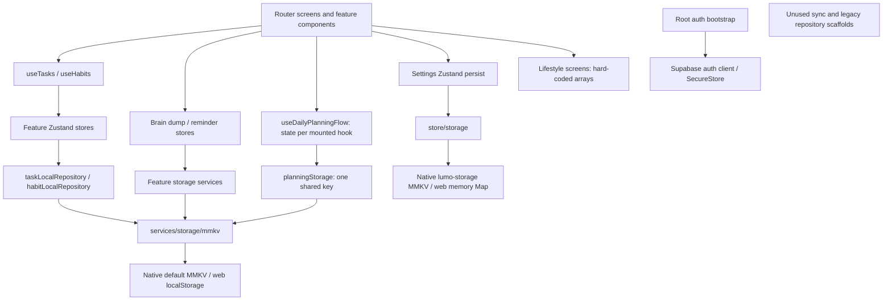

# Lumo — Repository, Product, and Launch Readiness Audit

**Audit date:** 24 September 2026 · **Repository:** `/Users/echoin.ink/Developer/lumo` · **Baseline:** `014ea9c1e35a57d92a176e6a94a62dedc663c2ab`

**Scope:** Read-only audit of the current implementation and its path to a complete, reliable **local-first MVP**. No fixes, dependency updates, migrations, commits, remote account operations, or repository edits were performed. This report and its evidence are stored outside the repository.

**Evidence standard:** “Implemented” means an actual execution path exists. “Persisted” means a storage write/read path exists; it does **not** mean native process-death testing passed. Findings identify source, direct runtime observations, isolated executable probes, or remaining verification. Filenames alone, comments, architecture documents, mock screens, and passing helper tests do not establish functionality.

**Coverage:** Inventoried all 555 tracked files; scanned 482 application/source TS/TSX/JS files, approximately 53,456 lines including tests/comments; traced routed UI into hooks, stores, repositories and storage; inspected configuration, dependencies, assets, tests, documentation and generated native configuration. There are **43 route files: 37 screen/redirect files and 6 layouts**. The evidence bundle includes the tracked-file inventory and static scan. Generated/vendor directories were examined where relevant, not counted as authored product implementation.

**Verification limits:** Production web export was exercised using a disposable local origin and no Supabase environment. Native production exports were attempted separately for iOS and Android. No signed native build, simulator/device installation, native MMKV restart, notification delivery, assistive-technology session, or App Store/Play Console account inspection was completed. No separate reference design attachment was available to compare pixel-for-pixel. The repository's visual tokens and actual assets were inspected; visual fidelity to an unavailable attachment remains unknown.

# 1. Executive Summary

**Lumo is a functional alpha with substantial prototype surfaces. It is neither an MVP candidate nor a release candidate yet.** It has a credible foundation for a local-first product and does not need an architectural rewrite.

The strongest implementation is the local task/habit foundation, quick capture, brain dump, routine-to-task creation, supportive copy, and the newer daily-planning components. These are genuine implementations, not uniformly mock screens. However, task timing and recurrence, habit write concurrency and streaks, planning synchronization, and storage failure recovery have important defects.

The broad lifestyle product is considerably less complete than the navigation suggests. Cleaning, meals, groceries, budget, payments, weight and workouts are sample-data screens with disabled creation. Calories are static summaries. Weekly meal planning, recipes and body measurements are absent. Notifications have local records and settings but **no OS delivery implementation**. The mascot system and production brand assets are absent.

Approximate completion is best expressed as **a minority of the requested feature families having usable local foundations, with most lifestyle domains still placeholder or missing**. A defensible overall percentage would require agreed acceptance criteria and would otherwise confuse visual coverage with completed functionality. No end-to-end domain can yet be signed off as production-ready under the requested criteria.

The decisive release blocker is independent of feature completeness: **both iOS and Android production exports fail Hermes compilation** on a dynamic import in the installed Supabase client. This occurs with remote configuration absent because auth imports remain in the startup graph. TypeScript and the existing tests pass, so the current validation pipeline can miss this mobile release failure.

| Gate | Audit result |
|---|---|
| TypeScript | Pass |
| Existing tests | 105 passed, 0 failed; 30 test files |
| ESLint | 0 errors, 89 warnings |
| Public Expo config | Resolves successfully |
| Expo Doctor, online | 19/20 checks pass; 11 dependency patch mismatches |
| Web production export | Pass; limited browser flows exercised |
| iOS production export | **Fail: Hermes rejects Supabase dynamic import** |
| Android production export | **Fail: same Hermes error** |
| Dependency security scan | 29 advisory-bearing packages: 12 high, 15 moderate, 2 low; exposure requires triage |
| Native install/restart/device QA | Not verified |

The recommended path is to repair the native build and local data contracts first, complete existing core workflows, then finish the promised lifestyle domains in connected vertical slices. Keep cloud/auth/sync/monetization out of the local release unless deliberately included with their additional acceptance criteria.

# 2. Architecture Assessment

## Current structure and configuration

| Area | Actual state and evidence |
|---|---|
| Runtime | Manifest targets Expo `~55.0.0`; installed/locked **55.0.26**, React Native **0.83.6**, React **19.2.0**, Expo Router **55.0.16**. [package.json](</Users/echoin.ink/Developer/lumo/package.json>) and lockfile are the source of versions. The versioned [Expo SDK 55 reference](https://docs.expo.dev/versions/v55.0.0/) was consulted. |
| Routing | `expo-router/entry`; root Stack with hidden headers; five visible tabs: Dashboard, Tasks, Calendar, Health, More. Hidden `dashboard` and `add` routes remain. Auth, onboarding and modal stacks plus planning, brain dump, parked, reminders and routines. [app/_layout.tsx](</Users/echoin.ink/Developer/lumo/app/_layout.tsx>), [app/(tabs)/_layout.tsx](</Users/echoin.ink/Developer/lumo/app/(tabs)/_layout.tsx>) |
| TypeScript | Strict mode; `skipLibCheck`; aliases `@/*` and `@/src/*` both resolve into `src`. Typed routes enabled, but many `as any` casts bypass route checking. [tsconfig.json](</Users/echoin.ink/Developer/lumo/tsconfig.json>), [app.json](</Users/echoin.ink/Developer/lumo/app.json>) |
| Feature organization | Stronger feature directories for tasks, habits, brain dump, reminders, planning and routines. Major screens still live directly in `app/`; tasks alone has 738 lines. New routes more often re-export feature screens. |
| Services | `src/services/api`, `src/services/repositories`, `src/services/storage` contain equivalents of the intended top-level folders. This nesting is maintainable; moving them solely to match a diagram has no MVP benefit. |
| State | Feature Zustand stores coexist with legacy domain stores in `src/store`. Planning is an important exception: each `useDailyPlanningFlow()` instance owns independent React state while writing the same storage key. |
| Persistence | Feature task/habit repositories; small brain/reminder/planning storage services; Zustand persistence for settings and older stores. Two distinct MMKV adapters have different instances and radically different web behavior. |
| Backend scaffolding | Supabase auth is reachable and bootstrapped. Sync queues, adapters, migration utilities and tests exist, but `SyncProvider` is unmounted and the active task UI does not call the sync repository. This is not functioning product-wide sync. |
| Styling | Shared token-backed primitives plus direct styles, NativeWind, a conflicting Tailwind palette and Expo template components. Real foundation, inconsistent application. |
| Tooling | Custom Node test runner, ESLint, TypeScript, Metro + NativeWind, Babel Expo preset. No tracked EAS configuration, CI workflow or formatter configuration found. |

The exact versions align with the SDK 55 generation; the audit does not justify changing Expo major versions. Resolve demonstrated compatibility/security problems and the Doctor patch mismatches within a controlled compatibility pass.

## Repository inventory details

- **Feature modules:** analytics, auth, brain-dump, budget, calendar, calmMode, dashboard, debug/sync, focus, habits, more, onboarding, planning, reminders, routines, start and tasks. Directory presence is not credited as product completion; the matrices below distinguish active versus unused implementations.
- **Shared layers:** `components`, `hooks`, `store`, `services`, `theme`, `constants`, `types`, `utils`, plus `animations`, `config`, `providers`, `stubs` and `testing`. `src/api`, `src/repositories` and `src/storage` are not top-level directories; their equivalents are nested in services. No change of folder nesting alone is required.
- **Core dependency families:** React/React Native/Expo/Router; Zustand; MMKV + Nitro; NativeWind/Tailwind/clsx/tailwind-merge; Reanimated/Worklets/gesture-handler; safe-area-context/screens; Lucide + SVG; FlashList; NetInfo; Supabase + URL polyfill; Expo blur/constants/dev-client/haptics/linear-gradient/linking/secure-store/splash-screen/status-bar/web-browser; React DOM/React Native Web. Tooling includes TypeScript, Babel Expo preset, ESLint and Expo ESLint config. Exact constraints are in [package.json](</Users/echoin.ink/Developer/lumo/package.json>).
- **Scripts:** `start` runs Expo; `android`/`ios` run native builds; `web` starts Expo web; `test`/`test:watch` use the custom Node runner; `typecheck` and `test:typecheck` run no-emit TypeScript; `lint` runs ESLint; `doctor` runs Expo Doctor; `export:web` exports to `dist`; `validate` chains typecheck → tests → lint → Doctor → web export. There is no explicit native production export script, store submission script or formatter script.
- **Utilities/models:** task/date/recurrence/focus selectors, result/error types, ownership/sync types, local storage keys, retry/network/accessibility helpers and analytics/observability scaffolds. Local domain types are strongest for tasks/habits/brain dump/reminders/planning; meal/budget models still live in legacy stores. The active build uses Metro; the retained webpack experiment is not the build source of truth.
- **Docs/assets:** architecture/UX/accessibility/motion/offline/auth documents exist under `docs/`. The full asset inventory has 23 files, with Expo/React template-oriented names, imports and inspected artwork; there are no Lumo cloud illustrations. Architecture comments and docs were compared to callers rather than accepted as evidence of integration.
- **Static-marker review:** searched TODO/FIXME/TEMP/HACK/mock/placeholder/dummy/sample, constants, timers, logging, disabled/touch controls, stubs and commented unfinished paths. Meaningful findings are registered in §5/§11. Developer migration fixtures are guarded by `__DEV__`; Reset Onboarding's Testing entry and starter routes are not equivalently excluded from production.

## Actual data-flow map

Sources: [src/features/tasks/store/useTaskStore.ts](</Users/echoin.ink/Developer/lumo/src/features/tasks/store/useTaskStore.ts>), [src/features/habits/store/useHabitStore.ts](</Users/echoin.ink/Developer/lumo/src/features/habits/store/useHabitStore.ts>), [src/features/planning/hooks/useDailyPlanningFlow.ts](</Users/echoin.ink/Developer/lumo/src/features/planning/hooks/useDailyPlanningFlow.ts>), [src/services/storage/mmkv.ts](</Users/echoin.ink/Developer/lumo/src/services/storage/mmkv.ts>), [src/store/storage.ts](</Users/echoin.ink/Developer/lumo/src/store/storage.ts>), [src/providers/SyncProvider.tsx](</Users/echoin.ink/Developer/lumo/src/providers/SyncProvider.tsx>).

## Strengths to preserve

- Feature-specific stores and local repository boundaries already work for the two principal editable domains.
- Route groups, shared UI primitives, domain types, ID/timestamp handling, task tombstones and local hydration are useful foundations.
- Newer features isolate serialization in services rather than scattering MMKV calls through visual components.
- No requirement to introduce a server, React Query, a new state library, or a new navigation framework to finish the local product.

## Smallest maintainable corrections

1. **Keep one authoritative task and habit implementation.** The feature implementations are live; the similarly named global stores and generic repositories are not substitutes. Reconcile any existing legacy keys before deleting code.
2. **Make daily planning shared state.** A small domain store or equivalent shared subscription solves a reproduced cross-screen consistency defect. It is justified by behavior, not a preference for extra layers.
3. **Standardize storage guarantees.** Align failure reporting, validation, schema versions and native/web behavior. A preferences persist adapter does not need an elaborate repository hierarchy, but it does need truthful durability.
4. **Move active screen bodies out of routes incrementally when touching them.** Preserve routing and screen behavior; no bulk directory reshuffle is necessary.
5. **Separate future account functionality from required guest startup.** Remove its ability to block the local release and avoid displaying unsupported ownership/sync promises. Preserve future-facing work until a dedicated phase can validate it.
6. **Use shared selectors for cross-domain summaries.** A shared date-aware calculation prevents Today, Health and other summaries from becoming separate sources of truth.

Important inconsistencies: active task comments describe a sync flow the code does not execute; `src/services/init.ts` describes mounting that root layout does not perform; entity `version` counters are sync metadata, not storage schema migrations; duplicated auth/onboarding/accessibility settings make it easy to wire a screen to the wrong store. Documentation should be reconciled after selecting canonical paths.

# 3. Feature Matrix

“Persistence: code” means a real local write/read implementation exists; native restart durability is still unverified. “Navigation: route” means route resolution and source wiring were checked, not every platform gesture. Production readiness is assessed against the requested product, with the native build blocker applying globally.

| Feature | UI | Logic | Persistence | Navigation | Production Ready | Status | Notes |
|---|---|---|---|---|---|---|---|
| Today / active Dashboard | Present | Real focus + flawed totals | Domain data + planning code | Visible tab; browser checked | No | Partial | Static name; all-task counts labeled today; stale planning summary |
| Morning/evening planning | Present | Real selection, carry, park | Code; daily reset problems | Routes linked | No | Partial | Independent hook copies; parked metadata lost at rollover |
| Tasks | Present | Real create/edit/complete/delete | Code; web reload verified | Visible tab; browser checked | No | Partial | Time dropped on create; edit can clear dates; recurrence metadata only |
| Calendar / schedule | Present | Real task filtering + week/day navigation | Reads tasks | Visible tab | No | Partial | Read-only date list; no event CRUD or timeline |
| Habits | Present | Real CRUD and dated completion | Code; unsafe concurrent writes | More + Health | No | Partial | Streak/date bugs; off-day habits hard to manage; no history UI |
| Brain dump | Present | Capture, archive, restore, convert | Code | Linked | No | Partial | Routine-idea conversion loses normal visibility; no edit |
| Quick capture | Present | Task / reminder / brain dump creation | Through feature paths | Sheet reachable | No | Partial | Reminder delivery absent; save failures not reliably surfaced |
| Routine bundles | Present | Editable drafts create actual tasks | Created tasks persist; drafts do not | Linked | No | Partial | Eight legitimate templates; no saved custom or recurring routine model |
| Parked items | Present | Partial restoration/deletion | Split across daily summary and entities | Linked | No | Broken | Task return does not restore date; parked IDs reset next day |
| Cleaning | Present | Static completion arithmetic | None | More | No | Placeholder | Four sample chores; dead checkboxes; add disabled |
| Meal entries | Present | Static calorie sum | None in live UI | More | No | Placeholder | Three sample meals; add disabled |
| Weekly meal planner | Absent | Absent | Absent | Absent | No | Missing | No actual planning model/flow |
| Groceries | Present | Static list | None | More | No | Placeholder | Four samples; checks not interactive; add disabled |
| Recipes / favourites | Absent | Absent | Absent | Absent | No | Missing | Not established by meal naming or templates |
| Budget / categories | Present | Arithmetic on constants | Unused RAM store only | More | No | Placeholder | No live budget/income/category management |
| Expenses | Add affordance disabled | Stub repositories/models | None in UI | No working expense flow | No | Placeholder | No real expense creation/edit/delete |
| Payments | Present | Static records | None | More | No | Placeholder | Paid states and dates are constants |
| Calories | Summary only | Constant goal/consumed values | None in UI | Health / Meals summaries | No | Placeholder | Health and Meals disagree; no independent calorie log/goals |
| Weight | Present | Static current/history | None | More / Health | No | Placeholder | Add disabled; unit/goal/history logic absent |
| Workouts | Present | Static count/calories | None | More / Health | No | Placeholder | Add disabled; no logging/edit/delete |
| Body measurements | Absent | Absent | Absent | Absent | No | Missing | No route/domain/storage found |
| Reminder records/settings | Present | Creation, normalization, settings | Code | Capture + settings | No | Partial | No complete management UI |
| Local notifications | Implied by UI | No delivery implementation | No OS IDs | No notification tap handling | No | Missing | Scheduling subsystem is scaffold only |
| General settings | Present | Several toggles save values | Native code; web memory only | More | No | Partial | Dark mode no-op; simplified/haptics/notifications not applied consistently |
| Onboarding | Four screens | Selection and completion real | Code | Direct routes/reset only | No | Partial | Fresh start skips it; preferences not applied to live dashboard |
| Focus / calm experience | Banner + components | State and rules partly live | Separate stores | Start action visible | No | Partial | Active task not used to isolate work; cognitive-load rules disconnected |
| Mascot feedback | No mascot art | Supportive text/icons only | N/A | N/A | No | Missing | No cloud assets/registry/contextual illustration system |
| Hidden weekly dashboard | Present | Static | None | Hidden route | No | Placeholder | Fake metrics, chart, wins and date controls |
| Auth/account | Forms present | Real Supabase calls | Session code | Reachable | No; not MVP requirement | Partial | External setup/runtime unverified; ownership and sync not completed |

## Domain acceptance findings

**Tasks.** `useTasks → feature useTaskStore → taskLocalRepository` is the live path. Create, edit, complete/uncomplete and delete mutate actual state and save locally. Priorities, descriptions and energy exist; tags/categories/subtasks do not. Today/Upcoming/Done/All filters are implemented, but Today excludes overdue tasks and date keys use UTC. `addTask()` omits `dueTime` even though the form submits it. The form represents only today/tomorrow/no date; editing any other dated task initializes “No date” and can erase the original date. Time is arbitrary text. Recurrence is saved and labeled but completing a task does not create/advance an occurrence. The tested recurrence utility is disconnected. Empty/loading/error components exist, but hydration failure can remain stuck in loading and background write failures only log. Deletion has confirmation and a “Park instead” alternative; that alternative reschedules to tomorrow without using the Parked registry. Sources: [app/(tabs)/tasks.tsx](</Users/echoin.ink/Developer/lumo/app/(tabs)/tasks.tsx>), [src/features/tasks/components/TaskFormModal.tsx:60](</Users/echoin.ink/Developer/lumo/src/features/tasks/components/TaskFormModal.tsx:60>), [src/features/tasks/store/useTaskStore.ts:67](</Users/echoin.ink/Developer/lumo/src/features/tasks/store/useTaskStore.ts:67>), [src/features/tasks/hooks/useTasks.ts](</Users/echoin.ink/Developer/lumo/src/features/tasks/hooks/useTasks.ts>), [src/features/tasks/utils/recurrence.ts](</Users/echoin.ink/Developer/lumo/src/features/tasks/utils/recurrence.ts>).

**Calendar.** Selected-day tasks are real and update from the same task store. Day/week navigation works in code. Rows are not task edit/complete entry points, there is no event model, no creation flow, no timeline, and no reliable chronological scheduling semantics. Completed items are included without a full event-style status interaction. The calendar icon is a touchable without an action. It has an empty list message, but no distinct hydration/error treatment. The date strip mixes local labels with UTC keys. Source: [app/(tabs)/calendar.tsx:18](</Users/echoin.ink/Developer/lumo/app/(tabs)/calendar.tsx:18>), [src/features/calendar/utils/calendarTasks.ts](</Users/echoin.ink/Developer/lumo/src/features/calendar/utils/calendarTasks.ts>).

**Habits.** The routed More screen and Health share the feature store. Create/edit/delete, scheduled daily/weekly filtering, completion and undo are genuine. `completedDates` persists history, but there is no history browser. Only today's habits are exposed for management, so a habit scheduled for another day cannot be conveniently edited/deleted today. Missing weekly target days behave as every day. Read-modify-write repository calls race; an isolated two-create probe retained only the second habit. “Best streak” means maximum current streak, not historical best; streak calculation returns zero for yesterday-only history despite intending to keep it active. Stored streaks can become stale; weekly scheduling is not respected by consecutive-day logic. `today` and weekday are memoized once per hook mount. Form saving does not wait for successful persistence; errors are not rendered by the main habit surfaces; deletion lacks confirmation/undo. Sources: [app/(tabs)/more/habits.tsx](</Users/echoin.ink/Developer/lumo/app/(tabs)/more/habits.tsx>), [src/features/habits/services/habitLocalRepository.ts:17](</Users/echoin.ink/Developer/lumo/src/features/habits/services/habitLocalRepository.ts:17>), [src/features/habits/services/habitLocalRepository.ts:235](</Users/echoin.ink/Developer/lumo/src/features/habits/services/habitLocalRepository.ts:235>), [src/features/habits/hooks/useHabits.ts:27](</Users/echoin.ink/Developer/lumo/src/features/habits/hooks/useHabits.ts:27>), [src/features/habits/components/HabitFormModal.tsx](</Users/echoin.ink/Developer/lumo/src/features/habits/components/HabitFormModal.tsx>).

**Today, Dashboard and planning.** Live focus suggestions, task/habit totals and planning choices exist. `calculateDailyProgress()` receives counts of **all tasks**, not today's tasks. A browser test completed a tomorrow task and produced “Today's essentials are complete.” Task data has no separate completion timestamp for historical daily reporting. Morning completion persisted across web reload but the already-mounted Dashboard remained stale after returning. Parking shifts task dates seven days forward; bring-back removes IDs but does not restore dates, and the daily summary drops parked IDs on rollover. Low-energy selection can label a high-energy task “tiny” simply because it is undated or due today. Habit routine suggestions use titles as identity and include completed habits. The selected next step is reconstructed only from the current short suggestion lists, so selection can disappear when rankings change. Recovery queues are deliberately capped at three; displayed queue counts should not imply total backlog counts. Sources: [app/(tabs)/index.tsx:108](</Users/echoin.ink/Developer/lumo/app/(tabs)/index.tsx:108>), [src/features/dashboard/utils/dashboardProgress.ts](</Users/echoin.ink/Developer/lumo/src/features/dashboard/utils/dashboardProgress.ts>), [src/features/planning/hooks/useDailyPlanningFlow.ts:42](</Users/echoin.ink/Developer/lumo/src/features/planning/hooks/useDailyPlanningFlow.ts:42>), [src/features/planning/services/planningStorage.ts:46](</Users/echoin.ink/Developer/lumo/src/features/planning/services/planningStorage.ts:46>), [src/features/planning/services/planningComposer.ts:106](</Users/echoin.ink/Developer/lumo/src/features/planning/services/planningComposer.ts:106>).

**Brain dump / quick capture / routines.** Capture, task conversion, reminder-record conversion, archive, restore and delete use real local stores. There is no brain-dump edit flow. “Routine idea” marks an entry converted without creating a routine or a destination where it can be retrieved normally. Conversions and writes are not transactional; a failed downstream save can still leave the source converted. Routine templates are legitimate starting content, not fake user history: applying them creates tasks. Draft edits are intentionally component-local, not saved custom routines. Emptying every template line can still produce an “Added” state with no tasks. A “Set a 10-minute timer” template creates text, not a timer. Sources: [src/features/brain-dump/screens/BrainDumpScreen.tsx:33](</Users/echoin.ink/Developer/lumo/src/features/brain-dump/screens/BrainDumpScreen.tsx:33>), [src/features/brain-dump/store/useBrainDumpStore.ts](</Users/echoin.ink/Developer/lumo/src/features/brain-dump/store/useBrainDumpStore.ts>), [src/components/capture/QuickCaptureSheet.tsx](</Users/echoin.ink/Developer/lumo/src/components/capture/QuickCaptureSheet.tsx>), [src/features/routines/services/starterBundles.ts](</Users/echoin.ink/Developer/lumo/src/features/routines/services/starterBundles.ts>), [src/features/routines/components/RoutineBundleCard.tsx](</Users/echoin.ink/Developer/lumo/src/features/routines/components/RoutineBundleCard.tsx>), [src/features/routines/services/createRoutineTasks.ts](</Users/echoin.ink/Developer/lumo/src/features/routines/services/createRoutineTasks.ts>).

**Cleaning.** All four chores, their scheduled descriptions, completed states and 2/4 progress are constants. Checkboxes have no handler. There is no cleaning repository/store/model, recurrence generation or persistence. Home-reset routine bundles create ordinary tasks and do not update Cleaning. Source: [app/(tabs)/more/cleaning.tsx:14](</Users/echoin.ink/Developer/lumo/app/(tabs)/more/cleaning.tsx:14>).

**Meals, recipes, weekly plan and groceries.** Meal totals come from a three-element sample array and a fixed 1,800 calorie target. Groceries are a separate four-element sample list with a fixed week label. Neither is linked to the unused meal store/repository. There is no meal CRUD, recipe model/editor/favourites, weekly assignment model, shopping-list generation, deduplication or quantity/unit editing. `mealRepository.create()` returns an object but stores nothing; reads are empty and update is unimplemented. Sources: [app/(tabs)/more/meals.tsx:13](</Users/echoin.ink/Developer/lumo/app/(tabs)/more/meals.tsx:13>), [app/(tabs)/more/groceries.tsx:13](</Users/echoin.ink/Developer/lumo/app/(tabs)/more/groceries.tsx:13>), [src/store/useMealStore.ts](</Users/echoin.ink/Developer/lumo/src/store/useMealStore.ts>), [src/services/mealRepository.ts](</Users/echoin.ink/Developer/lumo/src/services/mealRepository.ts>).

**Budget, expenses and payments.** Budget total/spent/remaining arithmetic is mathematically derived, but from hard-coded category values; it is not real financial state. No usable income, expense, budget/category or payment CRUD exists. The global Budget/Transaction models and RAM actions are a possible starting point, not an implementation connected to the screens. Generic repository creation returns unsaved objects, deletion reports success without a write, and summaries return zeros. No confirmed period, currency, precision, due-payment, paid-state or recurring-payment behavior exists. Sources: [app/(tabs)/more/budget.tsx:14](</Users/echoin.ink/Developer/lumo/app/(tabs)/more/budget.tsx:14>), [app/(tabs)/more/payments.tsx:12](</Users/echoin.ink/Developer/lumo/app/(tabs)/more/payments.tsx:12>), [src/store/useBudgetStore.ts](</Users/echoin.ink/Developer/lumo/src/store/useBudgetStore.ts>), [src/services/budgetRepository.ts](</Users/echoin.ink/Developer/lumo/src/services/budgetRepository.ts>).

**Health / wellness.** Habits inside Health are real. The calorie, weight, trend and workout summaries are not: Health shows 1,320 calories while the sample Meals total is 1,350; weight is 165.2 lb with an invented change; workouts show three sessions / 600 calories. Weight and workout detail histories are fixed arrays. There is no measurement module, goal settings, unit conversion, entry editing/deleting or shared aggregation. Do not infer wearable integration or a nutrition database requirement: manual local logging is sufficient for a basic MVP. Sources: [app/(tabs)/health.tsx:28](</Users/echoin.ink/Developer/lumo/app/(tabs)/health.tsx:28>), [app/(tabs)/more/weight.tsx:13](</Users/echoin.ink/Developer/lumo/app/(tabs)/more/weight.tsx:13>), [app/(tabs)/more/workouts.tsx:13](</Users/echoin.ink/Developer/lumo/app/(tabs)/more/workouts.tsx:13>).

**Settings / onboarding.** Notifications, haptics, simplified mode and reduced-motion values exist in settings. Only reduced motion has a meaningful shared consumer, and other animation paths use separate state. Dark mode's handler is a TODO. Profile edit and Privacy Settings route through a dispatcher that implements only Reset Onboarding. The reset works but is exposed as “Testing” in production UI. Onboarding stores selections and completion, yet the root redirect bypasses it; those preferences do not personalize the active Dashboard. Sources: [app/(tabs)/more/settings.tsx:113](</Users/echoin.ink/Developer/lumo/app/(tabs)/more/settings.tsx:113>), [src/store/useSettingsStore.ts](</Users/echoin.ink/Developer/lumo/src/store/useSettingsStore.ts>), [src/hooks/useReducedMotion.ts](</Users/echoin.ink/Developer/lumo/src/hooks/useReducedMotion.ts>), [src/hooks/useSimplifiedMode.ts](</Users/echoin.ink/Developer/lumo/src/hooks/useSimplifiedMode.ts>), [app/index.tsx](</Users/echoin.ink/Developer/lumo/app/index.tsx>), [src/features/onboarding/store/useOnboardingStore.ts](</Users/echoin.ink/Developer/lumo/src/features/onboarding/store/useOnboardingStore.ts>).

## Interaction and state coverage

| Domain group | Empty / loading / errors | Validation / edit / delete | Synchronization and accessibility |
|---|---|---|---|
| Tasks | Empty and retry UI exists; failed hydration can mask retry; writes silently fail | Title required; date/time incomplete; edit/delete real | Shared list state reaches calendar/dashboard; daily selectors wrong; icon/modal accessibility incomplete |
| Habits | Empty/loading present; error state not properly shown | Title required; weekly-day validation weak; CRUD real; delete immediate | Shared Health/More state; race and midnight bugs; controls labeled unevenly |
| Planning / parked | Empty fallbacks and supportive copy; hydration flag not consistently used by screens | Selection/carry/park implemented; no robust failed-write feedback | Shared persisted key, separate mounted state; accessible selection controls in newer components |
| Brain dump / capture | Empty state; hydration/failed-write handling incomplete | Nonblank text; conversion/archive/delete; no edit | Converted entities reach live task/reminder stores; no durable conversion transaction |
| Routine templates | Content exists even on fresh install; no storage loading needed for templates | Editable draft lines; empty bundle not rejected | Creates tasks; no saved custom routines or recurrence |
| Lifestyle placeholders | Static cards often make empty/error states unreachable; no actual loading needed yet | No functional forms or CRUD | No real domain synchronization; disabled controls sometimes honestly labeled “coming soon” |
| Preferences/onboarding | Persist middleware or feature hydration; limited recovery | Toggle/selection controls partly genuine | Conflicting settings stores; first-run route missing; native accessibility runtime unverified |

All visible domains still require small-screen, font-scaling, VoiceOver/TalkBack and reduced-motion testing; the presence of accessibility props is not a completed accessibility review. No fake delays were found in the routed local CRUD flows. Loading indicators, intentional empty arrays, and template starter content are not classified as fake data merely because they are constants.

# 4. Screen Audit

Every screen/redirect route is listed. Route groups such as `(tabs)` do not appear in external URLs. “Blocker” is screen-specific; the native build failure is a separate global blocker. Auth rows are conditional on shipping accounts. Hidden prototype routes should be removed from the release route graph or completed; `href: null` only hides a tab.

| Screen | Route / source | Functional | Placeholder Elements | Missing | Launch Blocker |
|---|---|---|---|---|---|
| Root entry | `/` — [app/index.tsx](</Users/echoin.ink/Developer/lumo/app/index.tsx>) | Redirects | None | First-run completion gate | Yes for intended onboarding |
| Today / live Dashboard | `/(tabs)` — [app/(tabs)/index.tsx](</Users/echoin.ink/Developer/lumo/app/(tabs)/index.tsx>) | Partial; browser checked | “Alex”; wrong daily scope | Shared planning refresh, genuine focus behavior | Yes |
| Tasks | `/tasks` — [app/(tabs)/tasks.tsx](</Users/echoin.ink/Developer/lumo/app/(tabs)/tasks.tsx>) | Real CRUD | Recurrence promise exceeds behavior | Time/date integrity, recurrence execution, reliable errors | Yes |
| Calendar | `/calendar` — [app/(tabs)/calendar.tsx](</Users/echoin.ink/Developer/lumo/app/(tabs)/calendar.tsx>) | Real selected-day tasks | Calendar-icon control | Schedule create/edit/timeline; date correctness | Yes for schedule scope |
| Health | `/health` — [app/(tabs)/health.tsx](</Users/echoin.ink/Developer/lumo/app/(tabs)/health.tsx>) | Habits + links | All non-habit summary metrics | Real health domain aggregation | Yes |
| Weekly dashboard | `/dashboard` — [app/(tabs)/dashboard.tsx](</Users/echoin.ink/Developer/lumo/app/(tabs)/dashboard.tsx>) | Render only; hidden | Stats, chart, wins, week label | Real calculations and picker | Yes if retained |
| Add tab | `/add` — [app/(tabs)/add.tsx](</Users/echoin.ink/Developer/lumo/app/(tabs)/add.tsx>) | Returns null; hidden | Obsolete interception comment | Redirect or removal | Yes if reachable in release |
| More hub | `/more` — [app/(tabs)/more/index.tsx](</Users/echoin.ink/Developer/lumo/app/(tabs)/more/index.tsx>) | Links work in code | Supportive “help” card has no support action | Real destinations/support entry | Destinations block |
| About | `/more/about` — [app/(tabs)/more/about.tsx](</Users/echoin.ink/Developer/lumo/app/(tabs)/more/about.tsx>) | Static informational page; not normally linked | Build `2024.5.26` | Real metadata, support/privacy access | Public-launch polish |
| Account | `/more/account` — [app/(tabs)/more/account.tsx](</Users/echoin.ink/Developer/lumo/app/(tabs)/more/account.tsx>) | Guest links; auth-guarded account | No functioning cloud data sync behind account architecture | Runtime auth/ownership/deletion validation if shipped | Conditional |
| Budget | `/more/budget` — [app/(tabs)/more/budget.tsx](</Users/echoin.ink/Developer/lumo/app/(tabs)/more/budget.tsx>) | Render only | Category totals, May 2024, disabled expense add | Budget/expense flows | Yes |
| Cleaning | `/more/cleaning` — [app/(tabs)/more/cleaning.tsx](</Users/echoin.ink/Developer/lumo/app/(tabs)/more/cleaning.tsx>) | Render only | Sample chores/checks/progress | CRUD, schedule, completion | Yes |
| Groceries | `/more/groceries` — [app/(tabs)/more/groceries.tsx](</Users/echoin.ink/Developer/lumo/app/(tabs)/more/groceries.tsx>) | Render only | Sample items/checks/week | CRUD and meal-plan integration | Yes |
| Habits | `/more/habits` — [app/(tabs)/more/habits.tsx](</Users/echoin.ink/Developer/lumo/app/(tabs)/more/habits.tsx>) | Real CRUD | Streak semantics misleading, not fixed mock values | Reliable writes, all-habit/history view, recovery | Yes |
| Meals | `/more/meals` — [app/(tabs)/more/meals.tsx](</Users/echoin.ink/Developer/lumo/app/(tabs)/more/meals.tsx>) | Render only | Sample meals/calories | Meal logging and relationships | Yes |
| Payments | `/more/payments` — [app/(tabs)/more/payments.tsx](</Users/echoin.ink/Developer/lumo/app/(tabs)/more/payments.tsx>) | Render only | Dates, amounts, paid flags | Payment CRUD/status | Yes |
| Settings | `/more/settings` — [app/(tabs)/more/settings.tsx](</Users/echoin.ink/Developer/lumo/app/(tabs)/more/settings.tsx>) | Mixed | Dark/Profile/Privacy controls; ineffective settings | Unified applied preferences | Yes |
| Weight | `/more/weight` — [app/(tabs)/more/weight.tsx](</Users/echoin.ink/Developer/lumo/app/(tabs)/more/weight.tsx>) | Render only | Current, change and history | Log/edit/delete/units | Yes |
| Workouts | `/more/workouts` — [app/(tabs)/more/workouts.tsx](</Users/echoin.ink/Developer/lumo/app/(tabs)/more/workouts.tsx>) | Render only | Sessions/count/calories | Log/edit/delete | Yes |
| Login | `/auth/login` — [app/auth/login.tsx](</Users/echoin.ink/Developer/lumo/app/auth/login.tsx>) | Real API/form code | Not a mock login | Configured service and device validation | Conditional |
| Sign up | `/auth/signup` — [app/auth/signup.tsx](</Users/echoin.ink/Developer/lumo/app/auth/signup.tsx>) | Real API/form code | None established | Confirmed email/deep-link/ownership flow | Conditional |
| Forgot password | `/auth/forgot-password` — [app/auth/forgot-password.tsx](</Users/echoin.ink/Developer/lumo/app/auth/forgot-password.tsx>) | Real recovery request code | None established | Service/email round trip | Conditional |
| Reset password | `/auth/reset-password` — [app/auth/reset-password.tsx](</Users/echoin.ink/Developer/lumo/app/auth/reset-password.tsx>) | Guarded recovery submit | None established | Robust invalid-session exit/back | Conditional |
| Auth callback | `/auth/callback` — [app/auth/callback.tsx](</Users/echoin.ink/Developer/lumo/app/auth/callback.tsx>) | Callback parsing/exchange code | None established | Invalid-link recovery navigation | Conditional |
| Onboarding start | `/onboarding` — [app/onboarding/index.tsx](</Users/echoin.ink/Developer/lumo/app/onboarding/index.tsx>) | Saves struggles | No first-run entry | Startup gating | Yes |
| Onboarding planning | `/onboarding/planning` — [app/onboarding/planning.tsx](</Users/echoin.ink/Developer/lumo/app/onboarding/planning.tsx>) | Saves required choice | Downstream personalization ineffective | Apply selection | Yes for represented preference |
| Onboarding focus | `/onboarding/focus` — [app/onboarding/focus.tsx](</Users/echoin.ink/Developer/lumo/app/onboarding/focus.tsx>) | Saves choices | Says choose 1–2 but no maximum enforcement | Consistent selection rules/application | P2 |
| Onboarding complete | `/onboarding/complete` — [app/onboarding/complete.tsx](</Users/echoin.ink/Developer/lumo/app/onboarding/complete.tsx>) | Completes and routes | No actual mascot | First-run lifecycle integration | Yes with onboarding |
| Brain dump | `/brain-dump` — [app/brain-dump/index.tsx](</Users/echoin.ink/Developer/lumo/app/brain-dump/index.tsx>) | Real capture/conversion/archive | Routine-idea destination missing | Edit, safe conversion/recovery | Yes |
| Parked | `/parked` — [app/parked/index.tsx](</Users/echoin.ink/Developer/lumo/app/parked/index.tsx>) | Archive restore works; task return flawed | “Bring back” does not restore due date | Persistent parking metadata | Yes |
| Planning hub | `/planning` — [app/planning/index.tsx](</Users/echoin.ink/Developer/lumo/app/planning/index.tsx>) | Links into planning | None fixed | Visible back/fallback navigation | P2 |
| Morning planning | `/planning/morning` — [app/planning/morning.tsx](</Users/echoin.ink/Developer/lumo/app/planning/morning.tsx>) | Real flow; browser checked | Low-energy suitability can be false | Shared state, save/hydration assurance | Yes |
| Evening planning | `/planning/evening` — [app/planning/evening.tsx](</Users/echoin.ink/Developer/lumo/app/planning/evening.tsx>) | Real carry/park/complete | No OS reminders despite reminder context | Shared state and durable recovery | Yes |
| Reminder settings | `/reminder-settings` — [app/reminder-settings/index.tsx](</Users/echoin.ink/Developer/lumo/app/reminder-settings/index.tsx>) | Stores settings | Quiet-hours/delivery/haptic claims | OS scheduler and applied settings | Yes |
| Routine bundles | `/routine-bundles` — [app/routine-bundles/index.tsx](</Users/echoin.ink/Developer/lumo/app/routine-bundles/index.tsx>) | Creates tasks | Empty bundle can claim Added | Validation; clarify template-only behavior | P2 edge case |
| Old add modal | `/modals/add-modal` — [app/modals/add-modal.tsx](</Users/echoin.ink/Developer/lumo/app/modals/add-modal.tsx>) | Opens/closes | All five options only go back | Actual add destinations or remove route | Yes if retained |
| Explore | `/explore` — [app/explore.tsx](</Users/echoin.ink/Developer/lumo/app/explore.tsx>) | Expo starter UI | Starter content/assets | Remove from production route graph | Public-launch blocker |

No specific routed navigation string was established to point to a nonexistent route in the current scanned flows. The more substantial issues are existing routes with blank/static content, unlinked duplicate screens, unsafe back behavior on cold links, and route casts concealing type guarantees.

The six layouts are [app/_layout.tsx](</Users/echoin.ink/Developer/lumo/app/_layout.tsx>), [app/(tabs)/_layout.tsx](</Users/echoin.ink/Developer/lumo/app/(tabs)/_layout.tsx>), [app/(tabs)/more/_layout.tsx](</Users/echoin.ink/Developer/lumo/app/(tabs)/more/_layout.tsx>), [app/auth/_layout.tsx](</Users/echoin.ink/Developer/lumo/app/auth/_layout.tsx>), [app/onboarding/_layout.tsx](</Users/echoin.ink/Developer/lumo/app/onboarding/_layout.tsx>) and [app/modals/_layout.tsx](</Users/echoin.ink/Developer/lumo/app/modals/_layout.tsx>). Root hides all headers; therefore a screen's own recovery/back control matters. `MoreScreenHeader` uses unconditional `router.back()`, whereas `ScreenBackButton` already supplies a useful reusable fallback pattern.

# 5. Placeholder / Simulated Functionality Register

**Severity:** P0 = prevents install/release or fundamental use; P1 = serious missing functionality/data integrity; P2 = public-launch trust/polish; P3 = inactive/post-MVP cleanup. “Yes” assumes the represented feature remains in the declared MVP. A feature can be explicitly removed from release scope later, but retaining fake operational UI is not an acceptable substitute.

| ID | File / component | Visible behavior | Actual implementation / missing | Severity | Blocks MVP? |
|---|---|---|---|---|---|
| S01 | [Weekly dashboard mockStats](</Users/echoin.ink/Developer/lumo/app/(tabs)/dashboard.tsx:18>) | Tasks 18/5, habit streak 7, calories 1320/1800, budget 420 | Constants, no store reads | P1 | Yes if retained |
| S02 | [Weekly dashboard chart/wins](</Users/echoin.ink/Developer/lumo/app/(tabs)/dashboard.tsx:50>) | Week progress, Friday highlight, wins and week selection | Fixed array/index and text; picker has no action | P1 | Yes if retained |
| S03 | [Dashboard header](</Users/echoin.ink/Developer/lumo/app/(tabs)/index.tsx:144>) | Personalized morning greeting | Always “Good morning, Alex”; no real name/time source | P2 | Public launch |
| S04 | [Daily progress](</Users/echoin.ink/Developer/lumo/app/(tabs)/index.tsx:108>) | Today's essentials/progress | Calculated from all task dates; real data with false daily meaning | P1 | Yes |
| S05 | [Recurring task completion](</Users/echoin.ink/Developer/lumo/src/features/tasks/store/useTaskStore.ts:100>) | “Every day/week/month” task | Only toggles completed; no next occurrence | P1 | Yes while repeat control exposed |
| S06 | [Timed task creation](</Users/echoin.ink/Developer/lumo/src/features/tasks/store/useTaskStore.ts:67>) | Time entered in form | `dueTime` dropped during create | P1 | Yes |
| S07 | [Calendar header icon](</Users/echoin.ink/Developer/lumo/app/(tabs)/calendar.tsx>) | Tappable calendar icon | No press handler; no picker/event flow | P2 | Resolve/remove before launch |
| S08 | [Cleaning](</Users/echoin.ink/Developer/lumo/app/(tabs)/more/cleaning.tsx:14>) | Four chores, times, 2/4 complete, checks, add | Sample array; checkbox touchables do nothing; creation disabled | P1 | Yes |
| S09 | [Meals](</Users/echoin.ink/Developer/lumo/app/(tabs)/more/meals.tsx:13>) | Meal log, calories/progress, add meal | Three samples sum to 1350; goal fixed; add disabled | P1 | Yes |
| S10 | [Groceries](</Users/echoin.ink/Developer/lumo/app/(tabs)/more/groceries.tsx:13>) | Four items, checked spinach, May 12–18, add | Static views; no checkbox writes; add disabled; empty branch unreachable with constant list | P1 | Yes |
| S11 | [Budget](</Users/echoin.ink/Developer/lumo/app/(tabs)/more/budget.tsx:14>) | Budget categories, spent/remaining, May 2024 | Mock totals 810 spent / 950 budget / 140 remaining; expense add disabled | P1 | Yes |
| S12 | [Payments](</Users/echoin.ink/Developer/lumo/app/(tabs)/more/payments.tsx:12>) | Upcoming/paid bills and add | Static names, amounts/dates/status; add disabled | P1 | Yes |
| S13 | [Health summary](</Users/echoin.ink/Developer/lumo/app/(tabs)/health.tsx:28>) | Calories, weight change, workout totals | Fixed 1320/1800, 165.2 lb / −2.8, 3 / 600; disconnected from logs | P1 | Yes |
| S14 | [Weight](</Users/echoin.ink/Developer/lumo/app/(tabs)/more/weight.tsx:13>) | Current weight, loss, four history entries | Fixed values; logging disabled | P1 | Yes |
| S15 | [Workouts](</Users/echoin.ink/Developer/lumo/app/(tabs)/more/workouts.tsx:13>) | Three sessions, durations/calories, add | Mock array; add disabled | P1 | Yes |
| S16 | [Dark mode](</Users/echoin.ink/Developer/lumo/app/(tabs)/more/settings.tsx:155>) | Switch implies theme change | TODO handler; DarkColors aliases light Colors | P1 | Yes if exposed |
| S17 | [Profile/Privacy rows](</Users/echoin.ink/Developer/lumo/app/(tabs)/more/settings.tsx>) | Edit/profile/privacy navigation | Handler only implements Reset Onboarding | P2 | Resolve/remove before launch |
| S18 | [General notifications setting](</Users/echoin.ink/Developer/lumo/src/store/useSettingsStore.ts>) | Notifications toggle | Saves boolean; no scheduler/permission consumer; separate reminder setting | P1 | Yes |
| S19 | [Simplified mode](</Users/echoin.ink/Developer/lumo/src/hooks/useSimplifiedMode.ts>) | Settings imply simpler screens | Hook has no production consumers; no layout/content change | P1 | Yes if exposed |
| S20 | [Haptics preference](</Users/echoin.ink/Developer/lumo/src/components/ui/Button.tsx:39>) | Off should stop haptics | Button invokes Expo Haptics without consulting setting; three preference sources exist | P1 | Yes for sensory control |
| S21 | [Reminder settings](</Users/echoin.ink/Developer/lumo/src/features/reminders/components/ReminderSettingsCard.tsx>) | Gentle reminders, quiet hours, tone and haptics | Values persist; no delivery/tone/quiet-hour enforcement; hours display-only | P1 | Yes |
| S22 | [Reminder schedule presets](</Users/echoin.ink/Developer/lumo/src/features/reminders/services/reminderSchedulePresets.ts>) | “Later”/scheduled reminder choices | Store a timestamp only; no notification request or ID | P1 | Yes |
| S23 | [Routine idea conversion](</Users/echoin.ink/Developer/lumo/src/features/brain-dump/screens/BrainDumpScreen.tsx:33>) | Convert thought into routine idea | Marks converted without a routine entity/destination; disappears from normal open list | P1 | Yes |
| S24 | [Bring back parked task](</Users/echoin.ink/Developer/lumo/src/features/planning/hooks/useDailyPlanningFlow.ts:257>) | Return item to active planning | Removes parking IDs, leaves due date seven days ahead | P1 | Yes |
| S25 | [Low-energy recommendation](</Users/echoin.ink/Developer/lumo/src/features/planning/services/planningComposer.ts:106>) | One “tiny” task | Due-date/no-date conditions can select high-energy work and label it tiny | P1 | Yes |
| S26 | [Start focus action](</Users/echoin.ink/Developer/lumo/src/features/focus/hooks/useFocusMode.ts>) | Focus session/task emphasis | Sets state/banner; live dashboard does not render active task isolation | P2 | Yes if full focus mode promised |
| S27 | [Use bundle](</Users/echoin.ink/Developer/lumo/src/features/routines/components/RoutineBundleCard.tsx>) | “Added” success | All-empty edited bundle can create zero tasks and still show success | P2 | Yes, narrow validation fix |
| S28 | [Legacy add modal](</Users/echoin.ink/Developer/lumo/app/modals/add-modal.tsx:42>) | New Task, Log Habit, Log Meal, Add Expense, Add Event | Every option calls only `router.back()` | P1 | Yes if route retained |
| S29 | [Hidden add route](</Users/echoin.ink/Developer/lumo/app/(tabs)/add.tsx>) | Navigable route | Returns null; layout no longer intercepts it as comment claims | P2 | Remove/redirect before launch |
| S30 | [About metadata](</Users/echoin.ink/Developer/lumo/app/(tabs)/more/about.tsx:10>) | Version/build information | Version literal; build `2024.5.26` unrelated to actual native build 1 | P2 | Public launch |
| S31 | [Explore](</Users/echoin.ink/Developer/lumo/app/explore.tsx>) | Publicly routable content | Expo starter/tutorial screen, not Lumo product | P2 | Public launch |
| S32 | [Unused Start focus](</Users/echoin.ink/Developer/lumo/src/features/start/components/TodaysFocusCard.tsx>) | Focus task completion | Mock array in local component state | P3 | No; not routed |
| S33 | [Unused Start actions](</Users/echoin.ink/Developer/lumo/src/features/start/components/QuickActions.tsx>) | Add task / quick actions | Unfinished handler/navigation, not active capture | P3 | No; not routed |
| S34 | [Unused Start progress/mascot](</Users/echoin.ink/Developer/lumo/src/features/start/components/ProgressSummaryCard.tsx>) | Default 3/6 and mascot-like slot | Default numbers and Sparkles placeholder, no illustration | P3 | No; not routed |
| S35 | [Unused Start reminder](</Users/echoin.ink/Developer/lumo/src/features/start/components/ReminderCard.tsx>) | Drink water every two hours | Static text, no schedule | P3 | No; not routed |
| S36 | [Unused habit screen](</Users/echoin.ink/Developer/lumo/src/features/habits/screens/HabitsScreen.tsx>) | Habits/streaks | Inline mock habits, not routed real habits | P3 | No |
| S37 | [Unused budget screen](</Users/echoin.ink/Developer/lumo/src/features/budget/screens/BudgetScreen.tsx>) | Budget/category dashboard | Separate mockBudget/mockCategories | P3 | No |
| S38 | [Unused alternate dashboard](</Users/echoin.ink/Developer/lumo/src/features/dashboard/screens/DashboardScreen.tsx>) | View All / upcoming | Real task/habit pieces mixed with static upcoming and action label without action | P3 | No |
| S39 | [Generic repositories](</Users/echoin.ink/Developer/lumo/src/services/mealRepository.ts>); [src/services/budgetRepository.ts](</Users/echoin.ink/Developer/lumo/src/services/budgetRepository.ts>); [src/services/taskRepository.ts](</Users/echoin.ink/Developer/lumo/src/services/taskRepository.ts>); [src/services/habitRepository.ts](</Users/echoin.ink/Developer/lumo/src/services/habitRepository.ts>) | Repository APIs appear to provide CRUD | Empty reads, unsaved creates, unimplemented updates, successful no-op deletes | P1 if reused | Not currently live; must implement before use |
| S40 | [Domain API clients](</Users/echoin.ink/Developer/lumo/src/services/api/tasks.ts>); [src/services/api/habits.ts](</Users/echoin.ink/Developer/lumo/src/services/api/habits.ts>); [src/services/api/meals.ts](</Users/echoin.ink/Developer/lumo/src/services/api/meals.ts>); [src/services/api/budget.ts](</Users/echoin.ink/Developer/lumo/src/services/api/budget.ts>) | Backend API abstraction | TODO endpoint scaffolds, not working remote domain APIs | P3 | No; defer backend |
| S41 | [ReducedMotionWrapper](</Users/echoin.ink/Developer/lumo/src/features/calmMode/components/ReducedMotionWrapper.tsx>) | Name implies animation reduction | Wrapper marker/unused animation scale cannot suppress child animation by itself | P2 | Relevant to live motion acceptance |
| S42 | [Support card](</Users/echoin.ink/Developer/lumo/app/(tabs)/more/index.tsx>) | Encouraging help-related content | Decorative card, no real support contact action | P2 | Add support access for public launch |
| S43 | [Future ownership diagnostic](</Users/echoin.ink/Developer/lumo/src/features/auth/utils/authDiagnostics.ts:306>); [merge/rename conflict helpers](</Users/echoin.ink/Developer/lumo/src/features/auth/services/migrationConflictStrategy.ts:249>) | Diagnostic/architecture implies ownership scanning and conflict strategies | Orphan scan returns `passed: true` while stating unimplemented; merge/rename explicitly report failure rather than perform resolution | P3 | No while future account/sync slice remains deferred |
| S44 | [Future focus recommendations/validation](</Users/echoin.ink/Developer/lumo/src/features/focus/services/focusModeService.ts>); [environment recommendations](</Users/echoin.ink/Developer/lumo/src/features/calmMode/services/environmentalRules.ts:78>) | Helpers imply contextual recommendations and valid active task | Simple clock-based suggestions; task validation checks UUID syntax, not existence; these recommendation helpers are not active product intelligence | P3 | No; do not advertise adaptive behavior |

Not classified as fake: title placeholders inside inputs; skeleton/loading components; intentionally empty fresh stores; legitimate routine templates; guarded development migration fixtures; real auth forms requiring external configuration. The scan also identified ten empty default callbacks in `MorningPlanningCard`; the live full planning screen supplies real callbacks, so these are not ten broken live controls. Empty unsubscribe/onRetry defaults are deliberate fallbacks, and template Pressables receive actions through wrapper props. No evidence of a fake success alert standing in for routed task CRUD was found. There are, however, **premature successful save closures** because persistence failures do not reach those forms.

# 6. Persistence Matrix

| Domain | Store | Repository | Persisted | Real Data | Problems |
|---|---|---|---|---|---|
| Active tasks | `features/tasks/store/useTaskStore` | `taskLocalRepository` | Native MMKV default / web localStorage, key `tasks` | Yes | Unvalidated raw array; writes background-log failures; time omission; recurrence not executed; no schema migration |
| Active habits | `features/habits/store/useHabitStore` | `habitLocalRepository` | Same adapter, `habits` | Yes | Async read-modify-write races; unvalidated shape; stale streaks/date; deletion tombstones not retained through later filtered writes |
| Brain dump | `features/brain-dump/store/useBrainDumpStore` | `brainDumpStorage` service | Same adapter | Yes | Partial normalization; no schema version or user-visible failed-save state; conversion durability |
| Reminders/settings | `features/reminders/store/useReminderStore` | `reminderStorage` service | Same adapter | Yes, local records | No OS IDs or delivery; no full management UI; settings conflict with general store |
| Daily planning/parking | Per-hook React state | `planningStorage` service | Same adapter, single summary key | Yes | Multiple snapshots overwrite/stale; daily reset discards parked IDs; no persistent parking entity/history |
| Active onboarding | Feature onboarding store | Direct calls to storage adapter | Same adapter | Yes | No startup gate; preferences not applied; nested schema not robustly validated |
| General settings | `store/useSettingsStore` | Zustand `createJSONStorage` adapter | Native **lumo-storage**; web **memory Map** | Yes | Web settings disappear on reload; settings often have no behavioral consumer; no migrations |
| Focus/calm | Feature focus/calm stores | Persist adapters/services | Persistence code exists | Some live state | Inconsistent preference sources; much presentation/rule logic unused |
| Legacy tasks | `store/useTaskStore` | Generic task repository separate | RAM only | Not active UI | Duplicate model/source, unsafe to wire without persistence |
| Legacy habits | `store/useHabitStore` | Separate older path | `habit-storage` through store adapter | Not active UI | Incompatible frequency/day representation; not shared with real habit screens |
| Meals | `store/useMealStore` | Generic meal repository stub | RAM only | No live records | UI uses its own constants; repository does not store |
| Budget/transactions | `store/useBudgetStore` | Generic budget repository stub | RAM only | No live records | UI uses constants; unsaved creates/no-op deletes |
| Cleaning/groceries/payments/weight/workouts | None serving UI | None serving UI | No | Mock data only | Complete local domain path missing |
| Weekly meals/recipes/measurements | Absent | Absent | No | No | Entire domain missing |
| Auth session | Active `useAuthSessionStore` plus two legacy auth stores | Supabase auth/session/SecureStore | Code exists | Real auth path, not verified against service | Owner ID regenerated on hydration; live domain repositories never get account scope |
| Sync/offline queues | Global stores and services | Queue/storage adapters | Extensive code | Not active product-wide sync | Provider unmounted; no actual current UI integration |

Primary adapter evidence: [src/services/storage/mmkv.ts](</Users/echoin.ink/Developer/lumo/src/services/storage/mmkv.ts>), [src/store/storage.ts](</Users/echoin.ink/Developer/lumo/src/store/storage.ts>), [src/store/createPersistStorage.ts](</Users/echoin.ink/Developer/lumo/src/store/createPersistStorage.ts>), [src/services/storage/storageKeys.ts](</Users/echoin.ink/Developer/lumo/src/services/storage/storageKeys.ts>). Active repositories are inside their features; that already satisfies the intended UI → feature → repository → local storage boundary.

**What disappears or is not durable:** meal/budget/legacy task RAM state; all unsaved form/template drafts; web general settings and other stores using the Map fallback; parked identifiers when a new daily summary is created. Placeholder screen constants are not “persisted user data”—there is no user record to save.

**Schema safety:** active task and habit loaders cast parsed JSON to arrays. A valid JSON object (`{}`) in task storage throws `tasks.filter is not a function`; malformed JSON falls back to an empty list, allowing later saves to overwrite data without a recovery option. Brain/reminder/planning normalizers provide some protection but do not constitute versioned migrations or strict date/relationship validation. No app-wide export/import or corrupted-state recovery flow was found.

**Failure semantics:** the web MMKV fallback catches write exceptions and ignores them. Native task writes are caught and logged without UI rollback/retry. Several stores update memory before writes; event-handler failures are not caught by a render ErrorBoundary. Successful visual state is therefore not proof of durable saving. A consistent save/error contract and recoverable raw-data handling are MVP requirements.

**Duplicate truth:** health versus meal calorie constants; live versus hidden versus unused dashboards; feature versus global habits/tasks/onboarding/auth; general versus reminder versus accessibility haptics; daily planning copies. Eliminate active contradictions first. Do not merge unrelated domains into one global store.

# 7. Design System Assessment

Lumo has a genuine reusable foundation, but it is not yet a consistently applied design system. Preserve the soft lavender/light visual identity and feature-specific layouts.

| Primitive / area | Current implementation | Assessment |
|---|---|---|
| Screen | [src/components/ui/Screen.tsx](</Users/echoin.ink/Developer/lumo/src/components/ui/Screen.tsx>) | Safe-area/scroll/keyboard options; fixed tab padding, style-spread risk, incorrect adjustable role on non-scroll container |
| Card | [src/components/ui/Card.tsx:99](</Users/echoin.ink/Developer/lumo/src/components/ui/Card.tsx:99>) | Seven variants, tokens, gradients; caller `style` replaces base style because props spread follows style. Pressable branch ignores caller style/other props |
| Button | [src/components/ui/Button.tsx:129](</Users/echoin.ink/Developer/lumo/src/components/ui/Button.tsx:129>) | Variants/loading/icons/a11y states; same caller-style override; haptics ignore preference |
| Text/Typography | [src/components/ui/Text.tsx](</Users/echoin.ink/Developer/lumo/src/components/ui/Text.tsx>), [src/theme/typography.ts](</Users/echoin.ink/Developer/lumo/src/theme/typography.ts>) | Shared variants exist; callers sometimes pass token names as literal colours; raw RN Text/template typography also exists |
| Input/form fields | [src/components/ui/Input.tsx](</Users/echoin.ink/Developer/lumo/src/components/ui/Input.tsx>), [src/components/forms/FormField.tsx](</Users/echoin.ink/Developer/lumo/src/components/forms/FormField.tsx>) | Both exist; stronger FormField semantics not consistently used; error-label association incomplete |
| SectionHeader | [src/components/ui/SectionHeader.tsx](</Users/echoin.ink/Developer/lumo/src/components/ui/SectionHeader.tsx>) | Reused successfully; some separately implemented headers remain |
| ProgressBar | [src/components/ui/ProgressBar.tsx](</Users/echoin.ink/Developer/lumo/src/components/ui/ProgressBar.tsx>) | Shared visual primitive; lacks full progressbar value semantics |
| FAB/Icon buttons | [src/components/ui/FloatingActionButton.tsx](</Users/echoin.ink/Developer/lumo/src/components/ui/FloatingActionButton.tsx>), [src/components/ui/IconButton.tsx](</Users/echoin.ink/Developer/lumo/src/components/ui/IconButton.tsx>) | Reusable candidates; many screens still use ad hoc touchables; IconButton not used in routed graph |
| Chips/tabs | Task filters, energy/recurrence controls, onboarding ChoiceChip | Semantically useful feature controls; repeated selected/disabled/spacing treatment could share a small primitive |
| Navigation | Router Tabs + More header + ScreenBackButton | Active navigation works in code; older custom app-tabs/navigation components are unused; fallback back behavior inconsistent |
| Sheets/modals | [src/components/ui/BottomSheet.tsx](</Users/echoin.ink/Developer/lumo/src/components/ui/BottomSheet.tsx>), task/habit form modals | Useful sheet exists, but keyboard/backdrop/close behavior and accessibility are duplicated |
| Empty/error/loading/success | `components/feedback/*` and duplicate `components/ui/EmptyState` | Broad reusable library; only part connected to real errors; do not equate component existence with resilience |
| Stat cards | `components/cards/StatCard` and `components/ui/StatCard` | Duplicate implementations, neither a reason to replace all feature cards with one generic card |
| Motion | `src/animations`, animated components, feature planning fade | Multiple systems; shared reduced-motion hook exists but not all consumers use it |

**Concrete style defect:** passing `style={styles.card}` to Card replaces its token-backed padding/background/radius/shadow instead of extending it. Most current screens do pass style. The same ordering in Button can remove its default minimum touch size and layout. Fix style composition before doing screen-by-screen visual polish; otherwise the same visual defect will recur. This is visible in the exported browser preview and directly established by JSX prop ordering.

**Token divergence:** [tailwind.config.js](</Users/echoin.ink/Developer/lumo/tailwind.config.js>) still defines a dark palette and a spacing scale different from `src/theme`; [src/constants/theme.ts](</Users/echoin.ink/Developer/lumo/src/constants/theme.ts>) contains Expo template tokens; [src/theme/colors.ts:104](</Users/echoin.ink/Developer/lumo/src/theme/colors.ts:104>) aliases dark colours to light ones. Screen styles mix token spacing with raw radii, heights, font sizes and literal colours. Auth/account pages use values such as `color="textSecondary"` while Text expects a real colour value. Their native visual result requires verification, but the API mismatch is concrete.

**Consolidate before launch:** correct Card/Button style composition; use canonical colour/spacing/type tokens for active screens; repair readable text-on-accent pairs; standardize close/back and error-field behavior; share small chip/form/modal mechanics where duplicated. Leave feature-specific meal, calendar, budget and planning layouts distinct.

## Mascot and feedback system

No `assets/images/lumo/clouds/` folder, cloud illustrations, `lumoClouds` registry, or equivalent reusable illustration-state component exists. Assets are Expo/react starter logos, splash/icon variants, tab icons, a glow and tutorial image. The standalone app icon inspected is Expo-branded; the generated iOS AppIcon image inspected is blank white. Existing supportive feedback is text, gradients and Lucide icons. The unused Start ProgressSummaryCard explicitly contains a mascot placeholder using Sparkles.

Because there is **no equivalent implementation**, the intended small central asset registry and `LumoIllustrationState` are appropriate additions. Use a few approved contextual states for initial release—empty/resting, focus/thinking, encouragement/you-tried, celebration—then expand to all nine states later. These names describe presentation intent, not inferred mental-health states. Decorative images should be hidden from assistive technology; meaningful feedback must also be text; optional animation must respect reduced motion. No duplicated mascot imports can be consolidated because actual mascot imports do not yet exist.

# 8. Neurodivergent UX Assessment

## Concrete strengths

- Active copy includes “A quiet day is still a valid day,” “You've started. That counts,” and low-pressure invitations. These are implemented in [src/features/dashboard/utils/dashboardProgress.ts](</Users/echoin.ink/Developer/lumo/src/features/dashboard/utils/dashboardProgress.ts>).
- Focus/review suggestions are capped; energy choices and tiny-step templates provide useful starting points.
- Quick capture and brain dump let a person record an intention before fully categorizing it.
- Carry-over, parking, archive and “Park instead” attempt recovery rather than punishment; their intent should be preserved while fixing data behavior.
- Routine bundles break some common activities into three concrete actions without requiring a complex project hierarchy.
- Newer buttons include explicit labels/selected states, several targets use 44-point minimums, and the shared reduced-motion hook combines OS and user preferences.

## Launch-critical issues

1. **Trust and memory support:** fabricated progress, unsaved data appearing saved, disappearing routine ideas and lost parking metadata undermine the planner's primary purpose. Treat these as functional defects, not cosmetic polish.
2. **Sensory preferences:** a user can turn haptics off while shared buttons still vibrate; simplified mode does not simplify; task/habit modal fades and planning motion do not consistently use the same reduced-motion decision.
3. **Readability:** token calculations against white give approximately 4.35:1 for primary purple, 2.72:1 for lavender, 2.65:1 for pink, 2.54:1 for blue and 2.54:1 for muted grey. Normal-size white button text on primary and text on lighter accents need correction; grey captions also need review. These are mathematical colour-pair checks, not a claim that every rendered combination was measured. [WCAG contrast guidance](https://www.w3.org/WAI/WCAG22/Understanding/contrast-minimum.html) uses 4.5:1 for normal text and 3:1 for large text.
4. **Operability:** habit edit/delete controls are approximately 32×32 (16-point icons plus 8-point padding) and colour choices are 36×36; modal close icons lack clear labels in task/habit forms; selection/checked state is inconsistent. Screen reader focus containment/return for custom modals and bottom sheets is unverified. Progress needs a meaningful role/value; Screen should not announce as adjustable.
5. **Recovery:** habits can be deleted immediately without confirmation/undo; off-day habits are hard to find; cold-link errors/back controls can strand people; error messages do not reliably follow failed saves.
6. **Time correctness:** UTC/local-day mismatches and stale hooks can move the perceived “today,” habit completion and reminders around midnight. This is especially material in the user's Auckland timezone.

## Important public-launch improvements

- Apply progressive disclosure to the three editable routine bundles embedded in Tasks and the broad More menu. Do not turn every task visit into a multi-form decision surface.
- Make a promised focus mode actually emphasize the selected task and reduce competing content; otherwise describe the existing state honestly.
- Preserve a chosen next step independently of changing suggestion ranking.
- Use neutral weight/measurement language. The current “Weight Loss” presentation and favourable colouring of a decrease assume an unwanted goal for some users.
- Keep streaks optional and forgiving; correct their arithmetic before celebrating them. Historic “best” must mean historical best if shown.
- Verify system font scaling and text wrapping on small devices. Text does not globally disable scaling, which is good, but fixed-height layouts and dense controls remain untested.

Advanced timers, richer task decomposition, adaptive dashboards, fully customizable routines, extended mascot animation and personalized recommendations can follow MVP. They are not prerequisites for fixing the existing quick-capture, planning and accessibility promises.

# 9. Notification Assessment

**Classification: scaffold only.** Local reminder records and settings are partial functionality; **notification delivery itself is missing**.

| Capability | Actual state |
|---|---|
| `expo-notifications` dependency/import/plugin | Absent |
| Permission explanation and OS request | Absent |
| Local reminder record creation | Implemented through QuickCapture/brain-dump conversion |
| Schedule presets | Timestamp calculation implemented and helper-tested |
| Native scheduling | Absent; timestamp storage is not scheduling |
| Persistent OS notification identifiers | Absent |
| Cancel on delete/complete | Absent |
| Reschedule on edit | Absent |
| Reconcile pending notifications after restart | Absent |
| Quiet hours | Displayed/default values stored; not enforced or editable in current card |
| Reminder tone | Preference stored; no delivered notification copy integration |
| Notification channels on Android | Absent |
| iOS notification configuration | Absent |
| Foreground/background behavior | Absent |
| Notification tap/deep link | Absent; auth deep linking does not implement reminder routing |
| Full reminder list/edit/delete/complete UI | Missing despite several underlying store actions |
| Denied/revoked permission UX | Absent |

Sources: [package.json](</Users/echoin.ink/Developer/lumo/package.json>), [app.json](</Users/echoin.ink/Developer/lumo/app.json>), [src/features/reminders/store/useReminderStore.ts](</Users/echoin.ink/Developer/lumo/src/features/reminders/store/useReminderStore.ts>), [src/features/reminders/hooks/useReminders.ts](</Users/echoin.ink/Developer/lumo/src/features/reminders/hooks/useReminders.ts>), [src/features/reminders/services/reminderSchedulePresets.ts](</Users/echoin.ink/Developer/lumo/src/features/reminders/services/reminderSchedulePresets.ts>), [src/features/reminders/components/ReminderSettingsCard.tsx](</Users/echoin.ink/Developer/lumo/src/features/reminders/components/ReminderSettingsCard.tsx>).

Planning surfaces reminders by matching the scheduled date, not checking whether the scheduled clock time has arrived. A reminder intended for later today can therefore be surfaced early. The separate general Notifications setting is not the same setting as `remindersEnabled`.

For a local-first MVP, use the SDK's local scheduling, permission and cancellation APIs behind a reminder service/repository boundary. Local notifications do not require account signup, a push server or cloud sync. Keep the reminder record, delivery status and OS ID linked; edits/deletes/settings changes must reconcile pending requests. Verify platform permission denial, app termination, timezone/DST changes, quiet hours and notification taps on real builds. See the exact [Expo SDK 55 Notifications reference](https://docs.expo.dev/versions/v55.0.0/sdk/notifications/).

# 10. Production / Release Assessment

## Checks actually performed

| Check | Result | What it establishes / does not establish |
|---|---|---|
| `npm run typecheck` | Pass, exit 0 | Current TS graph compiles; `as any` and unsafe JSON casts still bypass safety |
| `npm test` | 105 pass, 0 fail | Custom Node tests pass; not native UI/device acceptance |
| `npm run lint` | 0 errors, 89 warnings | Mostly unused code/imports, dependency-array and require warnings; no formatter pass |
| `expo config --type public --json` | Pass | Config parses/resolves; no EAS/signing/store ownership verified |
| `expo install --check` offline | Reported aligned, warned offline validation unreliable | Superseded by online Doctor result |
| Online `expo-doctor` | 19/20 checks pass | One compatibility check fails for 11 patch mismatches |
| `expo export --platform web` | Pass | Web asset bundling works without Supabase env |
| `expo export --platform ios` | **Fail** | Hermes rejects dynamic import in Supabase dependency |
| `expo export --platform android` | **Fail** | Same error independently reproduced |
| `npm audit --omit=dev --json` | 29 reported vulnerable packages | Advisory triage input; not 29 proven exploitable app bugs |
| Runtime browser sample | Passes basic boot/capture/complete/reload, exposes bugs | Only the exercised web flows, not an exhaustive mobile E2E run |
| Signed native compile/install | Not run | Blocked as a release acceptance gate; binary/link/signing issues remain unknown |

Exports/config/online diagnostics were run from an isolated copy of tracked sources with a symlink to installed dependencies, no `.env`, and all output under the audit directory. This prevented generated output/config changes in the repository. The native failure is reproducible even without a configured remote account.

**Native failure detail.** The compiler points to `otelModulePromise = import(…OTEL_PKG)` and reports `Invalid expression encountered`. This expression is in installed `@supabase/supabase-js/dist/index.mjs`, around line 71. The import chain includes [app/_layout.tsx](</Users/echoin.ink/Developer/lumo/app/_layout.tsx>), [src/features/auth/hooks/useSessionBootstrap.ts](</Users/echoin.ink/Developer/lumo/src/features/auth/hooks/useSessionBootstrap.ts>), [src/features/auth/store/useAuthSessionStore.ts](</Users/echoin.ink/Developer/lumo/src/features/auth/store/useAuthSessionStore.ts>) and [src/services/api/auth/supabaseAuth.client.ts:12](</Users/echoin.ink/Developer/lumo/src/services/api/auth/supabaseAuth.client.ts:12>). Fix the verified dependency-entry/compatibility problem or isolate the deferred account slice so it is absent from the local release bundle; prove the outcome with both native exports. An environment guard alone has already failed to prevent the bundle issue. No proposed fix was implemented or tested in this audit.

**Doctor patch mismatches at audit time:**

| Package | Installed | Doctor expected |
|---|---|---|
| expo | 55.0.26 | ~55.0.31 |
| expo-blur | 55.0.14 | ~55.0.18 |
| expo-constants | 55.0.16 | ~55.0.17 |
| expo-haptics | 55.0.14 | ~55.0.18 |
| expo-linear-gradient | 55.0.14 | ~55.0.18 |
| expo-linking | 55.0.15 | ~55.0.17 |
| expo-router | 55.0.16 | ~55.0.18 |
| expo-secure-store | 55.0.14 | ~55.0.18 |
| expo-splash-screen | 55.0.21 | ~55.0.25 |
| expo-web-browser | 55.0.16 | ~55.0.20 |
| react-native | 0.83.6 | 0.83.10 |

Resolve as a tested SDK-compatible patch set; this finding does not authorize or recommend a major-version migration.

**Dependency security.** Audit reports **12 high, 15 moderate, 2 low**, no critical. The dependency tree includes Expo/Metro/build tooling even under `--omit=dev`; many findings affect parsers/build inputs rather than a demonstrated device attack path. Examples include `image-size`/Metro, `@xmldom/xmldom`, `postcss`, `js-yaml`, and `query-string`/`decode-uri-component` through navigation. Determine installed path, reachable input and SDK-compatible remediation. The automated suggestion to downgrade Expo/Router across major generations is not an acceptable blanket fix. Preserve the JSON report and resolve or document relevant exposure before release; do not claim the app is secure merely because it is local-first.

## Runtime observations and reproducible probes

| Exercise | Observation |
|---|---|
| Fresh browser launch with no remote configuration | Dashboard loads as guest; onboarding is skipped |
| Morning planning → choose low-energy reset → complete → back | Saved choice not reflected in mounted Dashboard until reload |
| Reload Dashboard | Planning choice is restored, confirming web persistence for this service |
| Create “Audit: tomorrow timed repeat”, Tomorrow, Daily, 2:30 PM | Task created; upcoming/repeat labels visible; time missing |
| Complete that future task, then reload Dashboard | “Today” progress becomes 1/1 and “Today's essentials are complete” |
| Reload task state | Test task/completion survives web reload |
| Isolated task-store probe | Input dueTime absent from returned and persisted task; recurrence completion leaves a single completed record |
| Isolated wrong-shape persisted JSON probe | Task hydration rejects with `tasks.filter is not a function` |
| Two concurrent isolated habit creates | Only second habit remains in storage |
| Habit completed yesterday; complete then undo today | Stored streak becomes 0 despite yesterday's history |
| Prior-day planning summary with parked ID | Loading next day's summary loses parking ID |
| Routine-idea conversion | `converted` status, no linked entity ID |
| Auckland day-key example | 08:00 on 24 September at UTC+12 becomes `2026-09-23` with the current ISO-slice pattern |

The isolated probes use the repository test loader with mock in-memory storage; they did not alter user data. Browser-only warnings included the expected missing-Supabase configuration warning and React Native Web's animation-driver fallback. No crash occurred in those limited browser flows. Native accessibility warnings, React key warnings under other flows, assets on device, and platform-specific crashes remain runtime verification items.

## Resilience and recovery

Implemented: root [src/components/feedback/GlobalErrorBoundary.tsx](</Users/echoin.ink/Developer/lumo/src/components/feedback/GlobalErrorBoundary.tsx>), lower-level ErrorBoundary/ErrorState/RetryView/LoadingState/FatalErrorScreen components, local task retry UI, some empty states, confirmation for task and brain-dump deletion, offline/sync feedback components, and local observability abstractions.

Not established: successful failed-write recovery; shape validation for all persisted objects; versioned schema upgrades; quarantine/restore of corrupted state; upgrade/rollback compatibility; reliable hydration errors in every screen; non-destructive recovery from partial multi-entity conversions; native asset loading fallbacks; real background/resume/date-rollover handling. Offline/sync banners and retry helpers existing as files do not make them mounted or correct. Local workflows should remain usable in airplane mode without showing irrelevant network failures.

No external analytics/crash transport was found registered in the active flow. Existing observability buffers and development logging are not a deployed monitoring service. A new analytics stack is not required for MVP; useful local diagnostics and a support path are sufficient initially.

## App identity, platform and build configuration

| Area | Exists | Missing / required verification |
|---|---|---|
| Name/slug/version | `Lumo`, `lumo-mobile`, `1.0.0` | Confirm release ownership and intended identifiers |
| Identifiers | iOS/Android `com.meltmyheart.lumo` | Availability/ownership in developer accounts unknown |
| Scheme | `lumomobile`; auth callback parsing | Device deep-link recovery and notification destinations |
| Icon | Starter files; generated iOS icon inspected blank | Approved Lumo icon, config reference, Android adaptive/monochrome assets and real binary check |
| Splash | Starter splash asset and dependency | No splash plugin/asset configuration in app.json; brand implementation and device test |
| iOS native directory | Generated `ios/` exists locally and is ignored | Reproducible native configuration from tracked config/plugins or deliberate native-source policy |
| iOS version/build | Generated Info.plist 1.0.0/build 1; project MARKETING_VERSION 1.0 | Controlled build-number strategy in release pipeline |
| iOS target | Generated target iPhone-only; minimum iOS 15.1; Hermes/new architecture | Device matrix; decide tablet support intentionally rather than assume it |
| iOS privacy | Generated PrivacyInfo manifest, empty entitlements, development network/Bonjour strings | Review final merged privacy manifest and actual required APIs; remove/justify development-only release artifacts |
| iOS networking | Arbitrary loads false, local networking allowed | Final archive configuration and auth/network need if retained |
| Android native directory | None present | Generate/inspect merged release manifest and resources; package, min/target SDK, permissions and signing not binary-verified |
| Android edge-to-edge | SDK stack plus fixed tab/screen padding | Gesture navigation, system bars, cutouts, keyboard and safe-inset testing |
| Notifications | None of the required native setup | Permission/channel/service implementation and build-time config |
| Sensitive permissions | No app-level camera/location/health permission request found | Do not add permissions for manual logs; verify final merged manifests from dependencies |
| EAS | No `eas.json`, project ID or submit profiles found | Development/preview/production profiles and signing if choosing EAS; an equivalent reproducible native pipeline is also valid |
| Updates | No tracked channel/runtime/update policy; generated iOS updates disabled | OTA optional. Define binary-only releases first, or configure version compatibility if OTA is used |
| Environments | `.env.example`; ignored `.env` has public Supabase config names | Guest build must work with none; no secret values printed; avoid requiring cloud for local install |
| Validation pipeline | `validate` runs TS/tests/lint/Doctor/web export | Native export/build gate absent; no CI workflow found |

Source configuration: [app.json](</Users/echoin.ink/Developer/lumo/app.json>), [package.json](</Users/echoin.ink/Developer/lumo/package.json>), [babel.config.js](</Users/echoin.ink/Developer/lumo/babel.config.js>), [metro.config.js](</Users/echoin.ink/Developer/lumo/metro.config.js>), [.gitignore](</Users/echoin.ink/Developer/lumo/.gitignore>), [.env.example](</Users/echoin.ink/Developer/lumo/.env.example>). Installed native dependencies, including MMKV/Nitro, require validating a real development/release build; web export does not exercise them.

## Store preparation inventory

No complete submission package was found in the repository. Developer accounts and already-created store listings were not inspected, so their external existence is **unknown**, not proven absent.

| Item | Repository state / next requirement |
|---|---|
| App Store / Play app records and signing | Unknown externally; establish identifiers, signing ownership and upload path |
| Privacy policy | No finished public policy/working in-app link found; describe actual local data, optional network behavior, retention/deletion and backups |
| Support URL/contact | No working public support path identified; decorative help copy is insufficient |
| Marketing URL | Not supplied; optional where the store permits, useful for product identity |
| Screenshots / store graphics | No Lumo submission set found; capture final truthful screens at required current sizes |
| Description, keywords, categories | No finished store metadata found; prepare only after release feature scope stabilizes |
| Age/content rating | Questionnaire not evidenced; complete for intended audience and actual content |
| Privacy / data-safety declarations | Must be based on final binaries and included SDK behavior, not the phrase “local-first” |
| Review access/instructions | Explain account-free operation; if accounts remain, supply a working review path and implement required account lifecycle |
| Distribution testing | No TestFlight/Play test release evidence; account-specific testing eligibility requirements unknown |
| Health-related declarations/claims | Review applicable store health-content declarations for manual wellness tracking; avoid unsupported diagnosis/treatment claims |
| Encryption/export compliance | Complete applicable store questions using actual binary/dependency behavior |

Apple requires accurate privacy information, including third-party partners' behavior; Google requires a Data safety form and a privacy policy even for apps declaring no collection. These must be assessed against the final shipped functionality. [Apple app privacy guidance](https://developer.apple.com/help/app-store-connect/manage-app-information/manage-app-privacy/), [Google Data safety guidance](https://support.google.com/googleplay/android-developer/answer/10787469?hl=en).

If account creation ships, account-deletion and account-review obligations enter scope; the current account screen has sign-out but no complete deletion flow. Deferring the account surface keeps these backend tasks outside the local MVP. Review against [Apple App Review Guidelines](https://developer.apple.com/app-store/review/guidelines/) and the applicable [Google Play launch requirements](https://support.google.com/googleplay/android-developer/answer/9859455?hl=en). This audit identifies requirements; it does not draft store copy or submit anything.

# 11. Bugs / Technical Debt Register

Priorities describe impact, not estimated effort. P0–P1 items affecting the chosen release scope must be closed before MVP sign-off; P2 items require public-launch acceptance; P3 items may remain isolated.

| Priority | Issue | Evidence | Impact | Recommended Resolution |
|---|---|---|---|---|
| P0 · B01 | Both native production exports fail | Export logs; [src/services/api/auth/supabaseAuth.client.ts:12](</Users/echoin.ink/Developer/lumo/src/services/api/auth/supabaseAuth.client.ts:12>); installed Supabase dynamic import | Cannot produce current native production bundle | Resolve compatible native dependency path or remove deferred account imports from local release graph; re-export both platforms |
| P1 · B02 | Lifestyle product mostly static/missing | Register S08–S15; Feature Matrix | Main promised features cannot be used | Complete minimal local vertical slices; explicitly change release scope only by product decision |
| P1 · B03 | Notification controls without delivery | S18/S21/S22; reminder service files | Users cannot rely on reminders | Implement OS service, permissions, IDs, reconciliation, tap routing |
| P1 · B04 | Task create drops dueTime | [src/features/tasks/store/useTaskStore.ts:67](</Users/echoin.ink/Developer/lumo/src/features/tasks/store/useTaskStore.ts:67>); isolated/browser reproduction | Entered data lost immediately | Preserve/validate time through model, store and repository |
| P1 · B05 | Editing arbitrary date clears it | [src/features/tasks/components/TaskFormModal.tsx:71](</Users/echoin.ink/Developer/lumo/src/features/tasks/components/TaskFormModal.tsx:71>) | Existing scheduled work becomes undated | Preserve original date and support actual date selection |
| P1 · B06 | Recurrence picker is metadata-only | [src/features/tasks/store/useTaskStore.ts:100](</Users/echoin.ink/Developer/lumo/src/features/tasks/store/useTaskStore.ts:100>), recurrence utility has no caller | Repeating tasks stop after completion | Define occurrence identity/history and execute recurrence once per completion |
| P1 · B07 | Persist success not acknowledged | [src/features/tasks/store/useTaskStore.ts:93](</Users/echoin.ink/Developer/lumo/src/features/tasks/store/useTaskStore.ts:93>), task/habit forms | UI implies success while storage may fail | Propagate durable result; retry/rollback or explicit unsaved state |
| P1 · B08 | Habit repository loses concurrent writes | [src/features/habits/services/habitLocalRepository.ts:43](</Users/echoin.ink/Developer/lumo/src/features/habits/services/habitLocalRepository.ts:43>); probe | Data loss under overlapping actions | Serialize/atomically apply mutations against one authoritative state |
| P1 · B09 | No robust persisted-schema validation | Task loader line 63 and habit loader; probe | Crash/stuck loading or silent overwrite | Versioned validated envelopes and recoverable malformed-data handling |
| P1 · B10 | Hydration loading masks error | [src/features/tasks/hooks/useTasks.ts](</Users/echoin.ink/Developer/lumo/src/features/tasks/hooks/useTasks.ts>), [app/(tabs)/tasks.tsx](</Users/echoin.ink/Developer/lumo/app/(tabs)/tasks.tsx>) | No usable recovery after invalid data | Represent failed hydration as settled error with retry/recovery |
| P1 · B11 | Planning has multiple unsynchronized snapshots | [src/features/planning/hooks/useDailyPlanningFlow.ts:42](</Users/echoin.ink/Developer/lumo/src/features/planning/hooks/useDailyPlanningFlow.ts:42>); browser | Saved choices stale or overwritten across screens | Shared planning domain state/subscription |
| P1 · B12 | Parking resets daily; return leaves future date | [src/features/planning/services/planningStorage.ts:53](</Users/echoin.ink/Developer/lumo/src/features/planning/services/planningStorage.ts:53>), hook line 257 | Recovery flow hides work | Durable parking state separate from daily summary; restore explicit date/state |
| P1 · B13 | UTC day keys used as local day | Calendar line 18; task form; habit hooks; planning helpers | Wrong Today, completion and scheduling dates | One explicit local-day/timezone policy; DST-safe calendar arithmetic; refresh on resume/midnight |
| P1 · B14 | Dashboard reports all dates as today | [app/(tabs)/index.tsx:108](</Users/echoin.ink/Developer/lumo/app/(tabs)/index.tsx:108>); browser | False completion/progress | Shared date-scoped selectors and sufficient completion history |
| P1 · B15 | Routine idea conversion has no destination | [src/features/brain-dump/screens/BrainDumpScreen.tsx:33](</Users/echoin.ink/Developer/lumo/src/features/brain-dump/screens/BrainDumpScreen.tsx:33>), store | User's captured intention disappears | Create/retrieve real idea entity or retain as visible archived/open note |
| P1 · B16 | Conversion can succeed without durable target | Brain dump/capture mutations | Lost or duplicated intended work | Validate destination save, then mark source; idempotent local conversion |
| P1 · B17 | Haptics/simplified/notification preferences misleading | Settings, Button, useSimplifiedMode | Sensory and behavior promises not honored | Canonical preference sources wired into every relevant consumer |
| P1 · B18 | Low-energy options can be high effort | [src/features/planning/services/planningComposer.ts:106](</Users/echoin.ink/Developer/lumo/src/features/planning/services/planningComposer.ts:106>) | Recommendations contradict stated capacity | Separate due-ness from effort suitability and preserve accurate labels |
| P1 · B19 | No first-run onboarding gate | [app/index.tsx](</Users/echoin.ink/Developer/lumo/app/index.tsx>) | Setup never offered on fresh launch; preferences unused | Route after hydration and apply only supported preferences |
| P1 · B20 | Account ownership unsafe if shipped | Active auth store generates owner IDs; repository context setter unused | No verified account isolation or guest migration | Defer account surface for local MVP, or complete ownership lifecycle before exposing it |
| P1 · B21 | Insufficient text contrast in important controls | Colours and contrast calculations, §8 | Essential content difficult to read | Adjust foreground/background token pairs while preserving pastel surfaces |
| P2 · B22 | Card/Button style replacement | Card line 118; Button line 151 | Shared layouts, surfaces and touch-size contracts break | Compose caller styles with defaults, forward props deliberately |
| P2 · B23 | Streaks wrong/stale and “best” mislabeled | Habit repo line 235; hook line 66 | Unreliable/punitive feedback | Derive from valid scheduled history; distinguish current and historical best |
| P2 · B24 | Habit management only shows scheduled today | More habits + Health | Off-day habits hard to edit/delete | Add an all-habits management view and simple history |
| P2 · B25 | Habit deletion has no recovery | HabitListItem delete callbacks | Easy accidental data loss | Confirmation or reliable undo consistent with tasks |
| P2 · B26 | Weak validation and false empty-bundle success | HabitFormModal; RoutineBundleCard | Invalid schedules or success with no work | Required weekly days; reject empty bundle; await save outcomes |
| P2 · B27 | Web settings not persistent | [src/store/storage.ts](</Users/echoin.ink/Developer/lumo/src/store/storage.ts>) Map branch | Browser preferences reset; inconsistent tests | Durable supported-web adapter or explicitly constrain web support; native verification still mandatory |
| P2 · B28 | Accessibility labels/roles/targets incomplete | Screen, ProgressBar, TaskFormModal, HabitListItem | Screen-reader/touch access impaired | Fix primitives then audit live screens with assistive tech |
| P2 · B29 | Motion settings split across systems | useReducedMotion, calmMode, raw Modal fades | User choice not consistently honored | One effective motion decision and non-motion alternatives |
| P2 · B30 | Hidden/obsolete routes still accessible | Add, weekly dashboard, add-modal, Explore | Blank/fake screens reachable by deep link | Remove from release graph or implement/redirect; hiding tab is insufficient |
| P2 · B31 | Back/recovery navigation incomplete | MoreScreenHeader, planning hub, auth callback/reset | Cold-link dead ends | Reuse fallback-aware back and explicit invalid-link exit |
| P2 · B32 | Missing release identity/configuration | app.json, starter assets, absent EAS | Cannot reproduce a branded signed release | Configure assets, profiles, build numbering, signing and manifest review |
| P2 · B33 | SDK patch mismatch / advisory backlog | Doctor and npm audit logs | Compatibility and supply-chain uncertainty | Targeted tested remediation/triage; no blind major upgrades or downgrades |
| P2 · B34 | Tests miss important product paths | scripts/run-tests.js; native failure despite pass | False confidence from 105 green helpers | Add acceptance tests for persistence, dates, concurrent edits, recurring flows and native builds |
| P2 · B35 | Duplicated models/stores and inaccurate docs | Feature/global stores; services/init comments | Future work easily connects wrong implementation | Canonical ownership map; migrate existing data before retiring old paths |
| P2 · B36 | Auth literal colour names and token drift | Account/auth Text calls; Tailwind vs theme | Inconsistent/invalid native styling | Use supported token values and one active palette |
| P2 · B37 | Dense task forms and ineffective focus isolation | Active Tasks + Dashboard | Excess choices during core action | Progressive disclosure and honest focus behavior |
| P2 · B38 | No Lumo mascot or finished brand assets | Asset inventory; unused mascot placeholder | Intended brand/feedback missing | Approved static assets + central registry/presentation, expand later |
| P2 · B39 | Fixed safe-area/tab dimensions unverified | Screen and tab layout | Potential clipping/keyboard/system-bar issues | Device checks; use insets where defects confirmed |
| P2 · B40 | Selection identity tied to suggestion rank/title | Planning hook/composer | Next step disappears or collides after changes | Stable source IDs and stored selection resolution independent of shortlists |
| P3 · B41 | Old global stores/API/sync experiments | §12 | Complexity, misleading search results | Isolate/document and remove only proven unused code after compatibility review |
| P2 · B42 | Hard-coded display name/build and neutral-language gaps | Header, About, Weight | Trust/identity inconsistency | Dynamic neutral defaults, actual metadata, user-directed wellness language |
| P3 · B43 | Unvirtualized task rendering | Active Tasks ScrollView/map | Potential large-list jank; not measured | Test realistic backlog sizes; use existing list primitive if profiling supports need |

Some P2 accessibility/recovery items become P1 blockers where they prevent a core task on a supported device. The priority table must not be read as permission to ship inaccessible essential controls.

# 12. Dead Code / Unused Implementation

Reachability was checked from Expo route files through source imports and supported by targeted reference searches. Type-only files, test fixtures, platform variants, config-loaded modules and public barrels are **not automatically dead** just because a simple graph does not reach them. No runtime import cycle was detected by the limited scan; this is not a proof against every dynamic/platform-specific cycle.

## High-confidence unused or disconnected product paths

| Implementation | Evidence / disposition |
|---|---|
| `src/features/start/components/*` | No Start route imports them; mock focus/progress/reminder implementation. Preserve useful visual ideas, do not count as functionality |
| `features/tasks/screens/TasksScreen`, `features/habits/screens/HabitsScreen`, `features/budget/screens/BudgetScreen` | Active route files implement their own screens; these alternatives are not routed. Habit/budget versions are mocks |
| `features/dashboard/screens/DashboardScreen` and several related components | Live `app/(tabs)/index.tsx` is different; alternate cognitive-load/dashboard UI is disconnected |
| `features/onboarding/screens/OnboardingScreen`, old onboarding hooks/components/global store | Parallel older flow; current routes use newer feature shell/store. Do not merge data formats blindly |
| `src/store/useTaskStore`, `useHabitStore`, `useMealStore`, `useBudgetStore` | Not the stores consumed by routed task/habit UI; meal/budget screens consume no store |
| `src/services/taskRepository`, `habitRepository`, `mealRepository`, `budgetRepository` | Stub contracts used by scaffold/tests, not active local task/habit repositories |
| `features/tasks/services/taskSyncRepository` | No active UI caller; comments describing it as canonical do not match runtime |
| `src/providers/SyncProvider`, `src/services/init`, much queue/network/offline orchestration | Not mounted from root. Future groundwork, not functioning cloud synchronization |
| Legacy auth store/service/client variants | Active session bootstrap uses `useAuthSessionStore` and `services/api/auth/*`; other similarly named variants create ambiguity |
| `useSimplifiedMode`, `useCognitiveLoad`, most `src/animations/*` and animated wrapper family | Feature intentions with no active routed consumers for these paths; some separate motion remains active |
| Custom `components/app-tabs*`, navigation components, several cards, form/list helpers | Active router tab bar and direct screen implementations replaced these paths |
| `mockTasks`, `mockHabits` seed files | Not automatically seeded into active fresh task/habit data; safe test/demo material if clearly isolated |
| `webpack.config.js` | Metro is configured; file references uninstalled webpack config package and outdated `src/app` path |
| Expo starter assets/components/Explore | Several still reachable through Explore; remove that route before removing required assets |
| `scripts/reset-project.js` | Starter reset utility, not a product feature or validation step; do not run during cleanup |

Evidence examples: [src/features/tasks/screens/TasksScreen.tsx](</Users/echoin.ink/Developer/lumo/src/features/tasks/screens/TasksScreen.tsx>), [src/features/habits/screens/HabitsScreen.tsx](</Users/echoin.ink/Developer/lumo/src/features/habits/screens/HabitsScreen.tsx>), [src/features/budget/screens/BudgetScreen.tsx](</Users/echoin.ink/Developer/lumo/src/features/budget/screens/BudgetScreen.tsx>), [src/features/dashboard/screens/DashboardScreen.tsx](</Users/echoin.ink/Developer/lumo/src/features/dashboard/screens/DashboardScreen.tsx>), [src/store/useTaskStore.ts](</Users/echoin.ink/Developer/lumo/src/store/useTaskStore.ts>), [src/providers/SyncProvider.tsx](</Users/echoin.ink/Developer/lumo/src/providers/SyncProvider.tsx>), [webpack.config.js](</Users/echoin.ink/Developer/lumo/webpack.config.js>).

## Dependencies and type quality

- Most declared runtime packages have a plausible framework, native, build or source role. Lack of a direct app import is **not** enough to remove gesture-handler/screens/worklets/Nitro or Expo runtime dependencies.
- `expo-image` and `expo-symbols` are imported by source/template components but are not declared directly in package.json; they currently resolve transitively. Remove unused starter consumers or declare intentionally used dependencies explicitly.
- `expo-status-bar`, `expo-constants` and some template-oriented imports warrant cleanup review, but no removal is justified solely by the scan. `expo-web-browser` supports the starter external-link path; decide after removing Explore. `expo-blur` is used by the bottom-sheet implementation.
- `package.json` specifies Zustand 4 while a `resolutions` entry asks for 5; npm's installed lock remains 4. This is contradictory tooling configuration, not evidence the app should migrate to 5.
- `.npmrc` uses `legacy-peer-deps=true`, masking peer enforcement at install time. Reconcile the installed supported dependency set before relying on reproducible clean installs.
- The scan found **79 `any` type nodes and 66 `as any` assertions**, including tests. Concentrations in navigation casts, storage adapters and variant-style access matter more than deleting every `any`. Strict TypeScript does not validate persisted JSON casts.
- Repositories importing domain models from stores (meal/budget), cross-feature planning imports, duplicated result/error patterns, and unused scaffolds are concrete maintenance debt. Move types to the feature/domain boundary when implementing those domains; no general-purpose repository framework is needed.
- No evidence supports a broad framework rewrite, mandatory database replacement, or upgrading every package to latest. Perform only compatibility, security and stability changes required by the demonstrated issues.

# 13. Definitive MVP Gap List

This section assumes the product areas named in the request remain part of the declared local MVP. It does **not** silently redefine Lumo as a tasks-only app. A smaller initial release is possible, but would be an explicit product scope decision accompanied by removal of unavailable destinations and claims.

## A. MUST FIX BEFORE MVP

- [ ] Installable iOS and Android builds work offline with no account/environment configuration; B01 closed.
- [ ] Canonical feature stores/repositories are established; schemas validate and migrate without data loss; save failures are visible and recoverable.
- [ ] Local-day/time/timezone rules are consistent across task forms, calendar, habits, planning, statistics and reminders; midnight/resume behavior works.
- [ ] Tasks support durable create/edit/complete/delete, arbitrary supported dates/times, priority/energy, working filters and **real recurrence wherever exposed**.
- [ ] Calendar displays actual date/time data and offers the promised create/edit path; define basic event scope instead of presenting dead event controls.
- [ ] Habits support safe serialized CRUD/completion, all-habit management, honest history/streak semantics and deletion recovery.
- [ ] Morning/evening planning updates every mounted screen, preserves next-step identity, parks/retrieves work across days, and does not misclassify high-effort work as tiny.
- [ ] Brain dump/capture never lose an intention during conversion; every conversion has a durable retrievable destination; editing and recovery are available.
- [ ] Routine templates reject empty submissions and create durable tasks; template-versus-recurring-routine behavior is stated accurately.
- [ ] Cleaning has real items/routines, scheduling and completion with local persistence; repeat behavior must work if offered.
- [ ] Meals and recipes have basic manual CRUD; weekly meal assignments persist; groceries have editable/checkable items and deliberate meal-plan/recipe integration.
- [ ] Budget/category limits, income/expenses as chosen, and payment records have real CRUD, period/currency rules and correct derived totals. No external bank/payment execution is required.
- [ ] Weight, calories, workouts and measurements support basic manual dated entries, edit/delete, units and truthful summaries. No wearable APIs or nutrition service is required.
- [ ] Every dashboard/health/progress metric derives from canonical real state; no sample user history or fake success remains.
- [ ] Reminder records have an understandable management flow and actual local notification scheduling/cancellation/rescheduling with stored IDs and tap destinations.
- [ ] Onboarding appears appropriately on fresh install, remains skippable where intended, and only asks for preferences that the product honors.
- [ ] Settings persist and apply consistently; haptic and reduced-motion controls work; simplified/theme controls are implemented or explicitly excluded from the release UI.
- [ ] Core flows have readable contrast, adequate touch targets, meaningful labels/states and usable font scaling; no essential action is inaccessible.
- [ ] Render errors, failed saves, invalid persisted data, empty lists and interrupted flows have usable outcomes; destructive actions are deliberate or recoverable.
- [ ] Prototype/blank/legacy routes are removed or implemented; navigation/back behavior is tested from both normal entry and cold deep links.
- [ ] Core acceptance tests exercise real local repositories and UI flows; native kill/reopen and upgrade tests verify durability.

## B. SHOULD FIX BEFORE PUBLIC LAUNCH

- [ ] Complete branded icon/splash and a small contextual mascot presentation system; preserve supportive text without requiring animated art.
- [ ] Finish Card/Button style contracts, active token consistency, compact layouts, accessibility/motion QA, and neutral wellness language.
- [ ] Provide an understandable local data deletion/recovery policy and preferably a user-controlled backup/export/import path; cloud backup is not required.
- [ ] Triage dependency advisories and Doctor findings, remove production debug/testing entries, and document canonical architecture.
- [ ] Provide working support/privacy links, accurate metadata and final store-ready assets.
- [ ] Run representative backlog/performance testing and supported-device beta testing.

## C. SAFE TO DEFER

Advanced charts and historical insights; a separate weekly dashboard beyond truthful summaries; favourites if not part of the chosen basic recipe workflow; elaborate task hierarchies/tags; a focus timer if it is not offered as an implemented control; fully customizable routine libraries; all nine mascot states/animations; tablet-specific redesign if tablets are not a supported target; system-calendar import, nutrition databases, barcode scanning, bank feeds and wearable integrations; extensive personalization and experimentation infrastructure. Dark mode can be deferred **only with its current non-working control removed from the release UI**. Web parity can be a separate target, but should not be used as evidence of native durability.

## D. FUTURE PRODUCT PHASE

Accounts/authentication, ownership-safe guest migration, remote repositories, cloud sync/conflict resolution, shared planning, subscriptions/monetization, AI assistance, growth analytics, push servers and cross-device backup. Existing backend scaffolding may be preserved in isolation. Its amount of code does not justify bringing it into the local MVP dependency chain.

# 14. Launch Gap List

## Complete MVP → Production Release Candidate

- [ ] Every selected MVP acceptance criterion in §13 passes on real iOS and Android installations.
- [ ] Reproducible tracked configuration produces signed preview and production binaries with final identifiers, icons, splash and version/build numbering.
- [ ] Native export/compile, TypeScript, tests, lint and Expo diagnostics become explicit release gates; no untriaged serious dependency exposure remains.
- [ ] Cold start, airplane mode, process death, low-storage failure handling, malformed data, previous-version upgrades, timezone/DST, permission denial and notification reconciliation are tested.
- [ ] VoiceOver/TalkBack, font scaling, contrast, motion/haptics, keyboard, safe areas and back/deep links are accepted on supported devices.
- [ ] No mock metrics, prototype routes, no-op controls, production testing UI or inaccurate success copy remain.
- [ ] Beta distribution provides evidence from realistic repeated daily use, including missed days and recovery—not only first-launch screenshots.
- [ ] Support, local data handling/recovery, release notes and a rollback/hotfix process are ready. OTA updates are optional, but any configured updates must respect runtime compatibility.

## Production Release Candidate → App Store / Google Play Launch

- [ ] Developer/app records, signing and store ownership verified; required account-specific testing eligibility satisfied.
- [ ] Final store screenshots/graphics, descriptions, keywords/categories, supported countries/devices and age ratings prepared from the actual release.
- [ ] Public privacy policy and support contact work and are linked from the app where appropriate; marketing URL supplied if desired/required by chosen listing fields.
- [ ] App privacy/Data safety, health-content and other applicable content declarations reflect final code, native permissions and SDK behavior.
- [ ] App review instructions explain the account-free experience; any retained account creation has complete lifecycle/deletion and working review access.
- [ ] Correct signed binaries uploaded to TestFlight/Play testing, reviewed, then released with a staged monitoring/support plan.

No store copy, submissions or account changes were made during this audit. “Complete local MVP” and “approved by both stores” are separate gates; neither follows automatically from a successful JS export.

# 15. Recommended Implementation Sequence

The sequence below preserves existing architecture and makes dependencies explicit. It is ordered by what must become trustworthy before dependent work can be verified. Phases describe future work; none has been implemented by this audit.

| Phase | Objective and why now | Affected areas | Prerequisites | Expected outcome and completion criteria |
|---|---|---|---|---|
| 0 — Freeze release contract | Prevent parallel definitions of “MVP”; select canonical paths and treatment of future account UI | Product scope, route map, architecture notes, acceptance matrix | This audit | Named in-scope domains and basic workflows; no silent removal of requested areas; canonical state ownership documented |
| 1 — Restore native build | All later verification depends on an installable app | Supabase import boundary, Expo/RN compatible patches, dependency graph, build scripts | Phase 0 release boundary | Both production exports succeed; development builds install; guest operation requires no remote env; key advisories triaged |
| 2 — Establish durable local contracts | Fix underlying causes before adding more CRUD | Storage adapters, schema validation/versioning, date utilities, mutation result contracts, shared planning state, Card/Button contracts | Phase 1 | Malformed data recoverable; concurrent writes retained; failed saves surfaced; local-day rules specified; core primitives compose styles correctly |
| 3 — Complete planning core | Existing product becomes reliable before expanding breadth | Tasks/recurrence, habits/history, quick capture, brain dump, routines, calendar, parking, onboarding/preferences | Phase 2 | Create→edit→complete→delete→restart works; recurring/date flows correct; all captured/parked intentions retrievable; mounted screens synchronize |
| 4 — Finish lifestyle vertical slices | Build missing domains on proven local patterns | Cleaning; food/recipes→weekly plan→groceries; budget/categories→expenses→payments; wellness entries | Phase 2 models/contracts; Phase 3 scheduling integration | Each domain has model→local repository→store→UI CRUD, validation, empty/error states and restart tests. Food relationships and finance totals use one source each |
| 5 — Replace derived summaries | Aggregations need real, stable source data | Today, Health, budget totals, calorie summaries, habit history, any retained weekly view | Phases 3–4 | Change/delete a source record and every dependent view updates correctly; date-scoped selectors tested; no hard-coded user metrics |
| 6 — Deliver reminders | Scheduling depends on stable IDs, dates and mutation lifecycle | Reminder management, notification service, app config, settings, task/habit/payment links only as scoped | Phases 2–4 relevant entities | Permission flow, schedule/edit/delete/cancel, quiet hours, stored IDs and tap routes work on both platforms; no duplicates after restart |
| 7 — Finish accessible Lumo experience | Polish against completed behaviors avoids redesigning placeholders | Design tokens, touch/reader/motion contracts, simplified/focus modes, mascot assets, progressive disclosure | Core flows stable; can address critical a11y earlier | Small/large-text and assistive-tech acceptance passes; settings demonstrably work; supportive identity consistent |
| 8 — Harden and qualify RC | Test realistic recovery and distribution, not just helpers | Error recovery, migrations, backups decision, performance, native E2E, beta builds, CI/release checklist | Phases 1–7 | Acceptance suite and real-device scenarios pass; no open in-scope P0/P1; release config reproducible; beta findings resolved |
| 9 — Prepare and execute distribution | Store content must describe final verified app | Signing, EAS/equivalent pipeline, privacy/support, store assets/forms, review/release process | Phase 8 RC | Signed binaries accepted for submission; declarations match binary; review cleared and support/release ownership established |

Within Phase 4, the three lifestyle streams need not wait on each other. Dependencies inside each stream do matter: **recipe/meal model → weekly assignment → grocery generation**; **money/date/category model → transaction CRUD → budget/payment aggregation**; **dated/unit-aware wellness records → history → Health summary**. Cleaning can reuse proven scheduling patterns without duplicating task source data unintentionally.

Notifications can begin once the relevant entity lifecycle is stable; they should not be bolted onto mock screens. Critical accessibility fixes begin in Phase 2/3, with Phase 7 serving as complete experience acceptance. Cleanup of unused code should follow proof of canonical replacements and any required migrations, not precede it.

# 16. Final Launch Roadmap

## Phase 0 — Agree the local release contract

**Goal:** Establish one definition of the product being finished.

**Work:**

- Adopt this audit's baseline, defect IDs and real-versus-placeholder distinctions.
- Keep the requested lifestyle scope unless explicitly narrowed; define basic manual workflows and units/currency/date rules.
- Identify canonical feature stores/repositories; defer account/cloud UI and claims for the local release where appropriate.

**Definition of Done:**

- Every visible release destination has acceptance criteria and an owner of its data.
- Deferred features have no misleading operational UI in the release plan.

## Phase 1 — Make Lumo build and install natively

**Goal:** Obtain a dependable device environment for the rest of the work.

**Work:**

- Resolve the reproduced Hermes/Supabase import incompatibility.
- Align necessary SDK 55 patches and triage dependency advisories without broad upgrades.
- Add native export/build verification to the release workflow; create installable development builds.

**Definition of Done:**

- iOS and Android production exports pass and development builds launch as guests without remote configuration.
- Dependencies install reproducibly and the compatibility findings are resolved or explicitly justified.

## Phase 2 — Make local data trustworthy

**Goal:** Ensure the app retains and reports what a person actually saved.

**Work:**

- Validate/version schemas, preserve corrupt data for recovery, propagate save errors, prevent concurrent write loss.
- Establish local date/time rules and lifecycle refresh.
- Consolidate daily planning state and persistent parking semantics; correct Card/Button style contracts.

**Definition of Done:**

- Concurrent saves, invalid records, failed writes, process restart and date rollover have tested outcomes.
- Cross-screen state uses canonical stores; no UI success depends solely on memory changing.

## Phase 3 — Complete the daily planning core

**Goal:** Make Today, tasks, habits, capture and recovery dependable daily tools.

**Work:**

- Finish task dates/times/recurrence and calendar entry/edit integration.
- Correct habit history/streaks, all-habit management and deletion recovery.
- Fix brain-dump conversions, routine validation, parked restoration and low-energy selection.
- Wire first-run onboarding and supported preferences; make focus behavior honest and useful.

**Definition of Done:**

- A person can capture, plan, act, miss a day, recover, edit and restart without losing intentions.
- Current core P1 defects are closed and all mounted core screens stay synchronized.

## Phase 4 — Replace lifestyle placeholders with real local workflows

**Goal:** Fulfil the remaining declared product breadth using the existing architecture.

**Work:**

- Implement cleaning items/routines/schedules and completion.
- Implement meal/recipe CRUD, weekly assignments, grocery CRUD and the agreed relationships.
- Implement category/budget/transaction/payment flows with validated money/date semantics.
- Implement manual calorie, weight, workout and measurement entries with units and history.

**Definition of Done:**

- Every selected lifestyle domain has working CRUD, validation, empty/error states and restart persistence.
- No production screen shows sample user records; integration changes update the related feature.

## Phase 5 — Make every summary truthful

**Goal:** Ensure Dashboard/Health summaries represent real scoped activity.

**Work:**

- Replace fixed stats with shared selectors and correct date periods.
- Resolve future/overdue/completed task treatment, calorie/meal totals, budget totals and habit history.
- Remove the old weekly dashboard or finish only the useful real-data version.

**Definition of Done:**

- Adding, editing, completing and deleting a source record updates every relevant metric.
- Empty state means no data, not a sample chart; current-day statistics exclude unrelated dates.

## Phase 6 — Make reminders dependable

**Goal:** Deliver the reminders the interface promises.

**Work:**

- Add local notification integration behind a service boundary.
- Persist OS IDs and reconcile permissions, edits, deletion, quiet hours and restart.
- Complete reminder management and safe notification-tap navigation.

**Definition of Done:**

- Both platforms pass delivery, denial, cancellation, rescheduling, timezone and terminated-app tests.
- Notifications are optional, do not require accounts, and never remain scheduled for deleted records.

## Phase 7 — Complete accessible Lumo presentation

**Goal:** Deliver the intended calm, supportive identity with working sensory controls.

**Work:**

- Finish token consistency, contrast, touch targets, modal accessibility and font scaling.
- Apply motion/haptic/simplified preferences throughout active UI and reduce unnecessary simultaneous choices.
- Add approved mascot assets, a central registry and contextual presentation; complete icon/splash identity.

**Definition of Done:**

- VoiceOver/TalkBack, large text, reduced motion and disabled haptics work on supported devices.
- Every visible control acts as labeled; supportive feedback is contextual and accessible.

## Phase 8 — Qualify a production release candidate

**Goal:** Prove reliability under ordinary use and predictable failures.

**Work:**

- Test clean install, upgrades, offline use, process death, failed storage, malformed data, long histories and missed days.
- Run final dependency/config checks, native builds and realistic beta sessions.
- Finalize local recovery/backup expectations, support diagnostics and rollback/hotfix procedures.

**Definition of Done:**

- No open in-scope P0/P1 issue; public-launch P2 acceptance criteria pass.
- Repeatable signed builds match tested source; real-device QA and beta results are recorded.

## Phase 9 — Launch on the stores

**Goal:** Distribute the verified local-first release with accurate public information.

**Work:**

- Finish developer/store records, signing, final screenshots and metadata.
- Publish privacy/support information and complete applicable privacy, safety, age and health-content declarations.
- Submit tested binaries, resolve review feedback and release with a support/monitoring owner.

**Definition of Done:**

- App Store and Google Play approvals are complete for the intended markets/devices.
- Installed public builds match the verified feature set and local-data guarantees.
- Accounts/cloud/AI/monetization remain a separately scoped future phase.

---

## Evidence bundle and audit integrity

The [evidence folder](</Users/echoin.ink/.codex/visualizations/2026/09/24/01a0d1a1-154f-70d0-869c-b1fb283e60f4/lumo-audit/evidence>) contains the full tracked-file inventory, static scan, probe source/output, public Expo config, online Doctor output, separate native export logs, web export log, dependency audit JSON and source hash manifest. These are supporting evidence, not files added to the Lumo repository.

The probe source is for reproducibility with the current custom test loader; it operates on mock storage. The static reachability list requires the qualifications in §12 and must not be used as an automatic delete list. Build logs contain toolchain warnings as well as the decisive compiler error; undefined-global compiler warnings alone were not treated as app crashes.

**Integrity check:** All 555 tracked-file SHA-256 hashes matched the audit snapshot and `git status --porcelain` was empty at handoff.

**Report baseline:** Source citations refer to this audit's commit and working tree. Re-run acceptance checks after fixes; do not mark an issue resolved merely because a component or test file has been added.

- [iOS export log](</Users/echoin.ink/.codex/visualizations/2026/09/24/01a0d1a1-154f-70d0-869c-b1fb283e60f4/lumo-audit/evidence/export-ios.log>)
- [Android export log](</Users/echoin.ink/.codex/visualizations/2026/09/24/01a0d1a1-154f-70d0-869c-b1fb283e60f4/lumo-audit/evidence/export-android.log>)
- [Expo Doctor log](</Users/echoin.ink/.codex/visualizations/2026/09/24/01a0d1a1-154f-70d0-869c-b1fb283e60f4/lumo-audit/evidence/doctor-online.log>)
- [Dependency audit](</Users/echoin.ink/.codex/visualizations/2026/09/24/01a0d1a1-154f-70d0-869c-b1fb283e60f4/lumo-audit/evidence/npm-audit.json>)
- [Probe results](</Users/echoin.ink/.codex/visualizations/2026/09/24/01a0d1a1-154f-70d0-869c-b1fb283e60f4/lumo-audit/evidence/probes.log>)
- [Tracked inventory](</Users/echoin.ink/.codex/visualizations/2026/09/24/01a0d1a1-154f-70d0-869c-b1fb283e60f4/lumo-audit/evidence/tracked-files.txt>)
